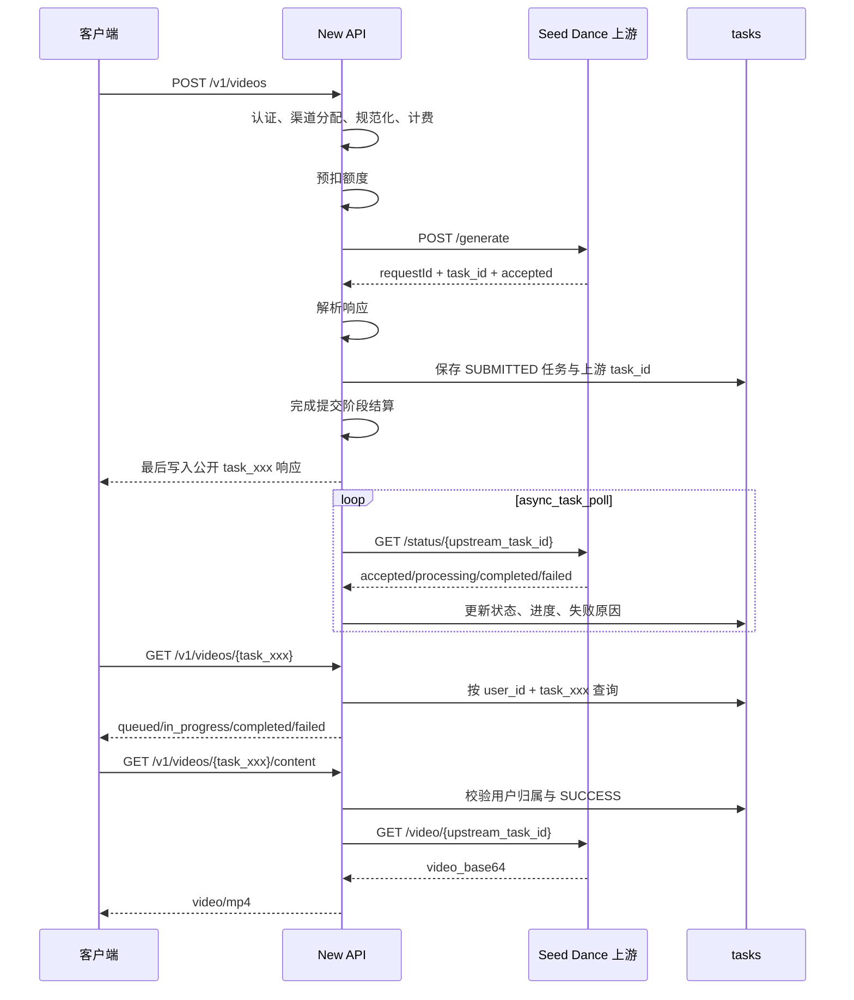

# 无审核 Seed Dance 异步视频渠道设计

日期：2026-07-24

状态：设计已确认并完成自检

目标仓库：`QuantumNous/new-api`

基线提交：`84a79b6807ac1a679ca86f34c8c6f39175c294d8`

## 1. 目标

为 New API 增加一个独立异步视频渠道：

```text
渠道显示名称：无审核 Seed Dance
公开模型名称：seedance-uncensored
```

客户端使用 New API 已有的 OpenAI 视频兼容接口：

```http
POST /v1/videos
GET  /v1/videos/{task_id}
GET  /v1/videos/{task_id}/content
```

适配器在内部映射到供应商接口：

```http
POST /generate
GET  /status/{upstream_task_id}
GET  /video/{upstream_task_id}
```

本功能必须完整复用 New API 的认证、渠道分配、模型映射、模型固定价格、模型倍率、分组倍率、预扣、提交结算、异步失败退款、任务超时退款和用户任务归属校验。

## 2. 供应商资料与现场证据

### 2.1 证据来源

用户提供的接口资料：

```text
本地只读来源：SOURCE_DOC_PATH（不提交到 Git）
SHA-256：4baebe2a397d2386905249f24b590b0c7654500fff473c140ec01c60476d1aa9
取得时间：2026-07-23（Asia/Shanghai）
```

该文件在本设计中称为“供应商提供资料”。它没有可识别的公开版本号或发布日期，因此本文只把文件中实际出现的字段作为资料契约，不把现场观察反向归因到资料。

现场测试时间为 2026-07-24，环境为目标服务器 `TARGET_HOST`。实施时新增脱敏证据：

```text
docs/api/fixtures/seed-dance/
├── generate-response.json
├── status-accepted.json
├── status-processing.json
├── status-completed.json
├── status-business-error.json
└── ffprobe-output.json
```

这些 fixture 不包含 API Key、图片 Base64、视频 Base64或可复用的供应商任务 ID。

### 2.2 供应商地址与传输行为

资料给出的基础地址：

```text
http://alb-o13xqj8f2cpjsa67ym.ap-northeast-1.alb.aliyuncsslbintl.com/v1/public_api/m-predict/polar4ai-i2v
```

2026-07-24 从目标服务器探测：

```text
HTTPS 443：连接超时
HTTP 80：服务可达并返回业务 HTTP 400
```

首版使用供应商当前实际可达的 HTTP 地址。渠道 Base URL 保持可配置；供应商后续开放 HTTPS 时，管理员可直接切换，不需要修改适配器。

### 2.3 供应商提供资料中的请求契约

生成请求字段：

```json
{
  "image_base64": "",
  "prompt": "A white flower slowly rotating against a black background, static camera.",
  "resolution": "720P",
  "duration": 1,
  "prompt_optimization": false,
  "multi_shot": false,
  "strict_duration": true,
  "negative_prompt": ""
}
```

资料声明：

- `image_base64` 为空、`null` 或缺省时使用 T2V；
- 有图片时使用 I2V；
- 图片接受纯 Base64、`data:image/jpeg;base64,...` 或 `data:image/png;base64,...`；
- 图片格式为 JPG 或 PNG；
- 建议输入图片不超过 5 MB，这是一项建议而不是硬性最大值；
- 图片宽高范围为 `240–8000`；
- 图片宽高比范围为 `1:8–8:1`；
- 分辨率为 `480P`、`720P`、`1080P`；
- `480P` 只用于 I2V；
- 请求参数表声明 `duration` 范围为 `1–15`；
- 参数表在 duration 说明中另列一个孤立的 `15`，本设计据此推定缺省值为 `15`；
- 资料末尾示例脚本仍写 `[1,10]`，与参数表存在冲突；
- `strict_duration` 缺省为 `false`；
- 建议状态轮询间隔至少 5 秒；
- 资料状态为 `running`、`completed`、`failed`；
- 视频结果位于 `/video/{task_id}` 的 `video_base64` 字段；
- `video_base64` 可能是纯 Base64，也可能带 `data:video/mp4;base64,` 前缀；
- 截至该供应商资料版本，未发现视频 JSON、Base64 或解码 MP4 的最大尺寸声明。

首版以正式参数表为准，接受 `duration=1–15`，并采用推定缺省值 `15`。确定性的单元测试和 Mock 测试保护该决定；后续实时行为如明确拒绝 `11–15` 或显示不同缺省值，则按实时行为更新契约和文档。

### 2.4 现场观察

目标服务器真实请求观察到：

```text
accepted → processing → completed
```

兼容状态分组：

```text
资料明确：running、completed、failed
现场观察：accepted、processing、completed
防御兼容：queued
```

提交成功响应：

```json
{
  "requestId": "REQUEST_ID",
  "task_id": "UPSTREAM_TASK_ID",
  "status": "accepted"
}
```

状态查询每次会返回新的 `requestId`。稳定任务标识是 `task_id`，`requestId` 只用于单次 HTTP 调试关联。

现场观察到部分业务错误仍使用 HTTP 200：

```json
{
  "success": false,
  "errCode": "400",
  "errMessage": "{\"detail\":\"Task not found\"}",
  "data": null
}
```

因此，每个接口都必须同时判断 HTTP 状态与 JSON 业务字段。

真实内容响应：

```json
{
  "requestId": "...",
  "video_base64": "AAAAIGZ0eXBpc29tAAACAGlzb21pc28y..."
}
```

现场视频：

```text
本地只读样本：TEST_ARTIFACT_PATH（不提交到 Git）
SHA-256：1c48470a46b851bcfdd0a1ca744818de5d53a2c9118eee3623c3c59cc0e23db4
```

已验证输出为 MP4，视频编码 H.264、音频编码 AAC。请求 `duration=1` 且 `strict_duration=true` 时，真实媒体时长仍约为 2.02 秒。因此计费使用规范化后的请求时长，不使用最终媒体时长。

## 3. 范围

### 3.1 本次包含

- 独立渠道类型与渠道注册；
- 独立 `TaskAdaptor`；
- 向后兼容的延迟任务成功响应接口；
- 向后兼容的 context-aware 任务轮询接口；
- OpenAI 视频提交、查询和内容下载；
- T2V 与单图 I2V；
- JSON 与 multipart 请求；
- 请求参数规范化；
- 模型固定价格和模型倍率兼容；
- 时长和分辨率附加倍率；
- 分组倍率；
- 预扣、失败退款和超时退款；
- 按需获取 Base64 视频并输出 MP4；
- OpenAI 视频路由专用错误结构与 404 语义；
- 渠道专用连通性测试；
- 前端渠道配置和国际化；
- Markdown 测试文档；
- 可导入 Apifox 的 OpenAPI 3.0.3 文件；
- 本地、Mock、容器和服务器真实端到端验证；
- GitHub 中介更新和服务器 Docker 部署。

### 3.2 本次不包含

- 新增供应商原生公开路由；
- 多图视频输入；
- 视频 Base64 持久化到数据库；
- 视频对象存储归档；
- 新增任务表或数据库迁移；
- 改造整个异步任务账务系统；
- 改变旧 `/v1/video/generations` 的错误兼容行为；
- 将 MP4 实际时长作为计费依据；
- 在没有供应商价格证据时按最终 token 重新计费；
- 额外创建昂贵的真实 I2V、1080P 或 15 秒验收任务。

## 4. 方案选择

选择“独立异步任务适配器 + 通用视频内容获取接口”。

未选择的方案：

1. 在现有 Doubao/Seedance 适配器中增加第二套协议分支。该方案会把两套鉴权、提交、状态和内容协议耦合在同一包中。
2. 新增供应商原生 Controller 和路由。该方案会重复实现认证、渠道分配、计费、任务、轮询和退款。

独立适配器能够复用核心能力，同时保持供应商协议边界清晰。

## 5. 总体架构



## 6. 渠道与组件

### 6.1 渠道常量

在当前基线提交上新增：

```go
ChannelTypeSeedDance = 59
ChannelTypeDummy
```

`ChannelTypeDummy` 必须继续位于所有实际渠道之后。

渠道属性：

```text
后端渠道名：seed-dance
前端显示名：无审核 Seed Dance
模型：seedance-uncensored
Endpoint Type：openai-video
```

`ChannelBaseURLs[59]` 使用供应商基础地址，管理员可在渠道配置中覆盖。

涉及：

```text
constant/channel.go
common/endpoint_type.go
relay/relay_adaptor.go
controller/channel-test.go
```

### 6.2 Seed Dance TaskAdaptor

新增：

```text
relay/channel/task/seedance/
├── adaptor.go
├── billing.go
├── constants.go
├── dto.go
├── adaptor_test.go
└── billing_test.go
```

职责：

- `adaptor.go`：请求校验、提交、轮询、状态转换和 OpenAI 视频响应转换；
- `billing.go`：统一解析时长与分辨率，返回 `OtherRatios`；
- `constants.go`：模型、状态、默认值、分辨率和超时；
- `dto.go`：供应商请求、提交响应、状态响应和视频响应；
- 测试文件保护参数、协议、状态和计费契约。

适配器实现：

```text
Init
ValidateRequestAndSetAction
EstimateBilling
AdjustBillingOnSubmit
AdjustBillingOnComplete
BuildRequestURL
BuildRequestHeader
BuildRequestBody
DoRequest
DoResponse
FetchTask
ParseTaskResult
ConvertToOpenAIVideo
GetModelList
GetChannelName
```

适配器嵌入 `taskcommon.BaseBilling`，复用提交后和完成后的无调整实现，并覆盖 `EstimateBilling`。供应商没有返回比规范化请求更可信的计费参数。

### 6.3 延迟提交成功响应

增加向后兼容的可选接口：

```go
type DeferredTaskSubmitResponder interface {
    BuildTaskSubmitResponse(
        info *relaycommon.RelayInfo,
        taskData []byte,
    ) (*TaskSubmitHTTPResponse, error)
}

type TaskSubmitHTTPResponse struct {
    StatusCode      int
    Body            any
    InitialStatus   model.TaskStatus
    InitialProgress string
}
```

`TaskSubmitResult` 增加可选的 `HTTPResponse *TaskSubmitHTTPResponse`。Seed Dance 的 `DoResponse` 只解析供应商响应，不调用 `c.JSON`；`RelayTaskSubmit` 对可选接口做类型断言，使用已预生成的 `RelayInfo.PublicTaskID` 构造安全的公开响应并放入 `TaskSubmitResult`。Controller 对非空 `HTTPResponse` 采用：

```text
解析供应商成功响应
→ 创建 Task，初始状态 SUBMITTED、进度 10%
→ 插入 Task
→ 完成 SettleBilling
→ 写消费日志
→ 最后向客户端写 200
```

该顺序确保 `Task.Insert` 失败发生在计费会话标记为已结算之前，现有请求级 `Billing.Refund` 仍可退回全额预扣。`SettleBilling` 失败时删除刚插入但尚未公开的任务、设置明确 `taskErr` 并触发请求级退款；删除失败记录管理员级一致性错误并由专门故障测试覆盖。任何失败都不向客户端返回成功任务，也不写消费成功日志。其他已有 `TaskAdaptor` 没有实现该可选接口时保持现有响应顺序。

### 6.4 Context-aware 轮询

保留现有 `FetchTask` 接口，并增加可选接口：

```go
type TaskFetcherWithContext interface {
    FetchTaskWithContext(
        ctx context.Context,
        baseURL string,
        key string,
        body map[string]any,
        proxy string,
    ) (*http.Response, error)
}
```

`service.updateVideoSingleTask` 优先调用该接口，旧适配器回退到原 `FetchTask`。Seed Dance 实现两个方法，旧方法使用受限背景 context 作为兼容入口，正常后台轮询使用调度器 context。

### 6.5 通用 VideoContentFetcher

在任务渠道公共接口层增加可选接口：

```go
type VideoContentFetcher interface {
    FetchVideoContent(
        ctx context.Context,
        baseURL string,
        key string,
        upstreamTaskID string,
        proxy string,
    ) (*VideoContent, error)
}

type VideoContent struct {
    ContentType   string
    ContentLength int64
    Body          io.ReadCloser
}
```

`ContentLength=-1` 表示长度未知。

`controller.VideoProxy` 按任务 `Platform` 获取 `TaskAdaptor`，对 `VideoContentFetcher` 做类型断言。Seed Dance 走该接口；现有 Gemini、Vertex、Sora 和 URL 代理路径保持原行为。

该边界把供应商内容协议留在适配器内，避免在 Controller 中继续增加渠道类型分支。

内容请求的 Base URL 先取 `constant.ChannelBaseURLs[channel.Type]`，再由渠道自定义 Base URL 覆盖；Seed Dance 不使用当前 Controller 中面向 OpenAI 的默认回退地址。渠道代理设置同步传给 `FetchVideoContent`。

## 7. 数据存储

不新增表和字段，复用现有 `Task`：

```text
Task.TaskID
  = New API 公开 task_xxx

Task.PrivateData.UpstreamTaskID
  = 供应商 task_id

Task.PrivateData.BillingContext
  = 提交时的价格和倍率快照

Task.PrivateData.ResultURL
  = /v1/videos/{public_task_id}/content

Task.PrivateData.Key
  = 本次提交实际选中的单个渠道 Key
```

`Task.Data` 只保存体积较小、经过供应商适配器清理的提交或状态响应。清理结果不包含供应商 `task_id`、API Key、图片 Base64 或视频 Base64。供应商任务 ID 只保存在 `Task.PrivateData.UpstreamTaskID`。

Seed Dance 使用第 6.3 节的延迟响应路径：

```text
DoResponse 只解析
→ 创建初始状态 SUBMITTED、进度 10% 的 Task
→ Task.Insert 成功
→ SettleBilling 成功
→ 最后向客户端返回 200
```

因此客户端收到成功 `task_id` 时，该任务已经可查询。`SettleBilling` 或 `Task.Insert` 失败时不返回成功 `task_id`，请求级退款使净扣费为零。

提交阶段通过 `ContextKeyChannelKey` 取得本次实际选中的单个 Key，并保存到现有 `Task.PrivateData.Key`，行为与 Gemini/Vertex 的任务归属方式一致。轮询和内容下载优先使用任务保存的 Key，避免多 Key 渠道把完整 Key 集合当成 Bearer Token，也避免轮换后历史任务改用错误凭据。该值属于数据库私有 JSON：

- 不返回客户端；
- 不写日志或 fixture；
- 不新增数据库列；
- 渠道配置中移除或禁用该 Key 后，历史任务的状态请求按渠道配置错误处理，不自动改用另一 Key；
- 渠道删除后，恢复相同渠道和 Key 才能继续处理历史任务。

## 8. 客户端请求契约

推荐 JSON：

```json
{
  "model": "seedance-uncensored",
  "prompt": "一朵白色花朵在黑色背景前缓慢旋转，固定镜头",
  "duration": 10,
  "size": "1280x720",
  "image": "",
  "metadata": {
    "prompt_optimization": true,
    "multi_shot": false,
    "strict_duration": false,
    "negative_prompt": ""
  }
}
```

接受：

- `application/json`；
- `multipart/form-data`；
- T2V；
- 单张 I2V；
- 图片纯 Base64；
- 图片 data URI；
- 通过 SSRF 防护客户端获取的 JPG/PNG HTTP 图片；
- multipart `input_reference` 文件。

## 9. 单一规范化对象

Seed Dance 不依赖通用 `TaskSubmitReq.Duration int` 或 `ValidateBasicTaskRequest` 完成最终解析，因为它们不能完整保留字段缺省、JSON `null`、显式 `0` 和非法数字之间的区别。

JSON 请求先使用保留字段存在性的 Raw DTO：

```go
type seedDanceRawJSONRequest struct {
    Model          json.RawMessage `json:"model"`
    Prompt         json.RawMessage `json:"prompt"`
    Duration       json.RawMessage `json:"duration"`
    Seconds        json.RawMessage `json:"seconds"`
    Size           json.RawMessage `json:"size"`
    Image          json.RawMessage `json:"image"`
    Images         json.RawMessage `json:"images"`
    InputReference json.RawMessage `json:"input_reference"`
    Metadata       json.RawMessage `json:"metadata"`
}
```

实际反序列化通过项目 `common.Unmarshal` 完成；不直接调用标准库 `json.Unmarshal`。`json.RawMessage == nil` 表示缺省，内容为 `null` 表示显式 JSON null，两者对可选字段都按“未设置”处理。显式零、空字符串、非数字和小数仍属于已设置的非法值并返回 400。

multipart 请求通过：

```go
common.ParseMultipartFormReusable(c)
```

读取 `form.Value` 和 `form.File["input_reference"]`，包括 `duration`、`seconds`、结构化 `metadata`、文件和布尔字符串。请求第一次进入 `ValidateRequestAndSetAction` 时生成单一规范化对象：

```go
type NormalizedRequest struct {
    Prompt             string
    ImageBase64        string
    Resolution         string
    Duration           int
    PromptOptimization *bool
    MultiShot          *bool
    StrictDuration     *bool
    NegativePrompt     string
}
```

可选布尔字段使用指针，以区分“缺省”和显式 `false`。缺省字段不强制覆盖供应商默认值。

规范化对象保存在 Gin context，并同时供：

```text
ValidateRequestAndSetAction
EstimateBilling
BuildRequestBody
```

后续渠道重试再次进入 `ValidateRequestAndSetAction` 时先检查缓存，命中后直接复用，不再次读取 multipart 文件、不再次下载远程图片，也不再次解码 Base64。`EstimateBilling` 和 `BuildRequestBody` 只能读取缓存的规范化对象，不回读原始请求。这样实际发送参数与计费参数完全一致。

## 10. 参数规则

### 10.1 Prompt

- 去除首尾空白后必须非空；
- 供应商请求使用规范化后的值；
- `metadata` 不覆盖顶层 `prompt`。

### 10.2 Duration

接受：

```text
duration
seconds
metadata.duration
```

规则：

- 多个字段同时存在且数值相同：接受；
- 多个字段数值不同：返回 `400 invalid_duration`；
- JSON 整数和只包含十进制数字的字符串（例如 `10`、`"10"`）：接受；
- 有效范围：`1–15`；
- 缺省值：`15`；
- JSON `null`：按未设置处理；
- 显式零、空字符串、负数、小数、指数形式、非数字和大于 15：返回 400；
- 通用 `MaxTaskDurationSeconds` 仍作为第二层防御；
- 计费使用规范化后的请求值。

### 10.3 Resolution

接受：

```text
metadata.resolution
size
```

映射：

```text
854x480 / 480x854      → 480P
1280x720 / 720x1280    → 720P
1920x1080 / 1080x1920  → 1080P
```

规则：

- 缺省值：`720P`；
- 大小写不敏感；
- `metadata.resolution` 与 `size` 映射结果不同时返回 `400 invalid_resolution`；
- 未识别尺寸返回 400；
- T2V + `480P` 返回 400；
- I2V 接受全部三个分辨率。

### 10.4 Image

解析顺序：

```text
multipart input_reference
→ input_reference
→ image
→ images[0]
→ metadata.image_base64
```

多个位置提供相同图片时归一化为一张。多个位置提供不同图片或 `images` 包含多张图片时返回 400。

“相同图片”通过规范化解码后字节的 SHA-256 判断，不比较来源字符串。data URI 只接受：

```text
data:image/jpeg;base64,...
data:image/png;base64,...
```

图片校验：

```text
MIME：image/jpeg、image/png
最小宽高：240×240
最大宽高：8000×8000
宽高比：1:8–8:1
```

供应商资料中的 `5 MB` 仅在 Markdown 中作为建议展示，不作为 Seed Dance 专用硬拒绝条件。远程图片通过 New API SSRF 防护客户端获取，每次重定向重新校验，并沿用 New API 平台已有的通用远程资源配置；本功能不增加专用 `5 MB`/`5 MiB` 输入上限。

### 10.5 供应商扩展参数

以下字段位于 `metadata`：

```text
prompt_optimization
multi_shot
strict_duration
negative_prompt
```

布尔字段必须是布尔值；字符串 `"true"` 或 `"false"` 只在 multipart 表单规范化阶段转换。`negative_prompt` 必须是字符串。

这些参数没有供应商独立价格依据，不增加额外计费倍率。

## 11. 提交与公开响应

适配器向供应商发送：

```http
POST {baseURL}/generate
Authorization: Bearer {channel_key}
Content-Type: application/json
```

供应商返回：

```json
{
  "requestId": "...",
  "task_id": "...",
  "status": "accepted"
}
```

New API 保存供应商 `task_id`，向客户端只返回公开任务 ID：

```json
{
  "id": "task_xxx",
  "task_id": "task_xxx",
  "object": "video",
  "model": "seedance-uncensored",
  "status": "queued",
  "progress": 10
}
```

`DoResponse` 返回给任务落库逻辑的 `taskData` 使用清理后的最小结构，例如：

```json
{
  "requestId": "...",
  "status": "accepted",
  "model": "seedance-uncensored",
  "seconds": "10",
  "size": "1280x720"
}
```

其中不包含供应商 `task_id`。

`ConvertToOpenAIVideo` 不把供应商原始 `Task.Data` 直接返回给客户端，而是从以下受控字段重新构造 `dto.OpenAIVideo`：

```text
Task.TaskID
Task.Status
Task.Progress
Task.SubmitTime / StartTime / FinishTime
Task.Properties.OriginModelName
Task.PrivateData.BillingContext.OtherRatios
Task.FailReason
```

`seconds` 从计费快照的 `seconds` 读取；分辨率倍率反向映射到 `480P`、`720P`、`1080P` 的规范尺寸。这样后台轮询覆盖 `Task.Data` 后，状态接口仍稳定返回公开字段，也不会泄露供应商响应。

## 12. 状态轮询

复用现有 `async_task_poll`，默认约每 15 秒：

```http
GET {baseURL}/status/{upstream_task_id}
Authorization: Bearer {channel_key}
```

状态映射：

| 供应商状态 | New API 状态 | OpenAI 状态 | 进度 |
|---|---|---|---:|
| `accepted` | `SUBMITTED` | `queued` | 10% |
| `queued` | `QUEUED` | `queued` | 20% |
| `running` | `IN_PROGRESS` | `in_progress` | 30% |
| `processing` | `IN_PROGRESS` | `in_progress` | 30% |
| `completed` | `SUCCESS` | `completed` | 100% |
| `failed` | `FAILURE` | `failed` | 100% |

规则：

- 明确 `failed` 才进入失败终态；
- 瞬时网络错误保持原状态，下一轮重试；
- 未知状态由 `ParseTaskResult` 返回可重试解析错误，通用轮询器保留数据库原状态；不得返回空状态，否则通用状态机会把任务错误地标记为失败；
- 最终由 New API 任务超时机制结束长期异常任务；
- 轮询阶段不调用 `/video`；
- 成功任务的结果 URL 指向本地 `/v1/videos/{public_task_id}/content`。

`FetchTask` 在把响应交给通用轮询层之前生成供应商响应的清理副本：保留 `requestId`、`status`、`message` 和 `optimized_prompt`，移除供应商 `task_id` 及任何 Base64 字段。`ParseTaskResult` 解析该清理副本，通用轮询日志与 `Task.Data` 都不接触原始供应商任务 ID 或媒体内容。

## 13. 内容下载

客户端：

```http
GET /v1/videos/{public_task_id}/content
```

New API 校验：

```text
任务存在
任务属于当前用户
任务状态为 SUCCESS
渠道存在
上游 task_id 非空
```

供应商请求：

```http
GET {baseURL}/video/{upstream_task_id}
Authorization: Bearer {channel_key}
```

支持：

```json
{"video_base64":"AAAAIGZ0..."}
```

和：

```json
{"video_base64":"data:video/mp4;base64,AAAAIGZ0..."}
```

处理：

- 使用客户端 request context 派生下载 deadline，并在客户端断开时取消上游请求；
- 读取完整供应商 JSON，检查 HTTP 状态以及 `success`、`errCode`、`errMessage`、`status`、`message` 等业务字段；
- 只从验证通过的响应取出 `video_base64`，识别并移除可选的 `data:video/mp4;base64,` 前缀；
- 创建权限为 `0600` 的临时文件；Linux 上打开后立即 `unlink`，其他平台在关闭时显式删除；
- 使用严格 Base64 解码器将完整内容写入临时文件，任何尾部非法字符都在响应头发出前被发现；
- 校验完整解码结果包含有效 MP4 `ftyp`；
- `seek` 回文件开头，并以实际解码文件长度设置 `Content-Length`；
- 只有全部验证成功后才写 200 响应头，然后从临时文件流式输出；
- 成功、业务失败、解码失败、超时和客户端取消都关闭并清理临时文件；
- 不设置 Seed Dance 专用 JSON、Base64 或 MP4 大小上限；
- 沿用部署环境已有的 HTTP、反向代理、文件描述符、内存和磁盘资源约束；
- 将来供应商发布明确限制时，再采用供应商值。

Base64、解码 MP4 和临时文件路径不写入数据库或日志，临时文件不作为长期缓存或归档。

响应：

```http
Content-Type: video/mp4
Content-Disposition: inline; filename="{public_task_id}.mp4"
Cache-Control: private, max-age=3600
X-Content-Type-Options: nosniff
```

## 14. 计费

### 14.1 推荐模式

推荐使用 `ModelPrice`，其含义是：

```text
720P 每输出秒基础价格
```

定义：

```text
P = ModelPrice
D = 规范化后的请求时长
R = 分辨率倍率
G = 核心解析出的最终分组倍率
Q = QuotaPerUnit，当前为 500000
```

公式：

```text
费用 = P × D × R × G
quota = P × D × R × G × Q
```

部署测试初始配置：

```text
ModelPrice["seedance-uncensored"] = 0.15
```

该值用于首版测试和上线基线，管理员可在后台修改。

### 14.2 分辨率倍率

已确认：

```text
480P  = 0.5
720P  = 1.0
1080P = 2.25
```

`EstimateBilling` 返回：

```json
{
  "seconds": 10,
  "resolution": 2.25
}
```

### 14.3 ModelRatio 兼容

如果没有 `ModelPrice`，但管理员配置：

```text
ModelRatio["seedance-uncensored"] = M
```

则沿用 New API 当前异步任务语义：

```text
quota = M / 2 × D × R × G × Q
```

如果两种配置同时存在，`ModelPrice` 优先。值为零沿用现有免费模型语义。

代码不把猜测价格或中性倍率写入全局默认价格表。部署时在现有运行时价格 Map 中增加 `ModelPrice=0.15`，保留其他模型配置。这样管理员随后可删除固定价格并切换到 ModelRatio。

### 14.4 分组倍率

适配器不重复计算分组折扣。核心规则：

```text
存在 UserGroup → UsingGroup 特殊倍率时使用特殊倍率；
否则使用 UsingGroup 普通倍率。
```

提交时解析出的最终倍率写入 `BillingContext.GroupRatio`。

### 14.5 安全换算

- 所有用户控制的时长在计费前限制到 `1–15`；
- 分辨率只从显式枚举读取；
- 使用 `PriceData.AddOtherRatio`；
- 使用 `common.QuotaFromFloatChecked`；
- 配额钳制事件进入管理员审计信息；
- `seedance-uncensored` 不加入 `TASK_PRICE_PATCH`。

### 14.6 生命周期

```text
规范化请求
→ 计算完整额度
→ 强制全额预扣
→ 提交供应商
```

提交失败时退回预扣。供应商明确失败或任务超时时，通过现有终态 CAS 和 `RefundTaskQuota` 退款。成功时保留提交额度：

- 不按最终 MP4 时长重算；
- 不构造虚假 token；
- 不按不存在的供应商 usage 结算；
- `BillingContext` 保存提交时的价格和倍率快照。

响应头：

```http
X-New-Api-Other-Ratios: {"seconds":10,"resolution":2.25}
```

### 14.7 示例

使用：

```text
ModelPrice = 0.15
GroupRatio = 1
```

| 请求 | 费用 | quota |
|---|---:|---:|
| 5 秒、480P | $0.375 | 187500 |
| 5 秒、720P | $0.75 | 375000 |
| 5 秒、1080P | $1.6875 | 843750 |
| 15 秒、720P | $2.25 | 1125000 |
| 15 秒、1080P | $5.0625 | 2531250 |
| 5 秒、1080P、组倍率 0.8 | $1.35 | 675000 |

## 15. 错误处理

每个接口同时解析 HTTP 状态和业务字段：

```text
success
errCode
errMessage
status
message
```

`success` 在 DTO 中使用 `*bool`：字段缺省时不判定失败，只有显式 `false` 才进入业务错误处理。`errCode` 同时接受字符串和数字表示；缺省、空字符串或数值零按无业务错误处理，其他值结合 `errMessage` 转换为标准错误。

标准客户端错误：

```json
{
  "error": {
    "message": "duration must be between 1 and 15",
    "type": "invalid_request_error",
    "code": "invalid_duration"
  }
}
```

映射：

| 场景 | HTTP | 类型 |
|---|---:|---|
| 参数缺失或冲突 | 400 | `invalid_request_error` |
| 模型价格未配置 | 400 | `invalid_request_error` |
| API Token 无效 | 401 | `authentication_error` |
| 任务不存在或不属于用户 | 404 | `invalid_request_error` |
| 任务未完成时获取内容 | 400 | `invalid_request_error` |
| 供应商认证失败 | 502 | `upstream_error` |
| 供应商限流 | 429 | `upstream_rate_limit_error` |
| 供应商网络或格式异常 | 502 | `upstream_error` |
| 供应商下载超时 | 504 | `upstream_timeout_error` |
| Base64 或 MP4 无效 | 502 | `invalid_upstream_response` |

客户端响应不包含 API Key、完整供应商响应、Base64、内部堆栈或服务器路径。

仅对 OpenAI 视频路由增加专用 error writer：

```text
POST /v1/videos
GET  /v1/videos/{task_id}
GET  /v1/videos/{task_id}/content
```

提交和状态接口把内部 `dto.TaskError` 包装成上述嵌套 `error` 对象；内容代理现有 error writer 增加 `error.code`。旧 `/v1/video/generations/...` 保持现有扁平错误结构和兼容行为。

OpenAI 视频路径的不存在或越权语义为：

```text
GET /v1/videos/{task_id}          → 404
GET /v1/videos/{task_id}/content  → 404
```

旧 `/v1/video/generations/{task_id}` 的既有 400 行为不改变。客户端 Token 无效仍返回 401；供应商返回的 401/403 属于渠道凭据错误，映射为客户端 502，不伪装成客户端认证失败。

## 16. 超时和重试

阶段超时：

```text
POST /generate：60 秒
GET /status：30 秒
GET /video：120 秒
连接建立：10 秒
```

全部请求使用 context，并遵循渠道代理设置。

具体实现：

- 提交：Seed Dance `DoRequest` 从 `c.Request.Context()` 派生 60 秒 deadline，并使用 `http.NewRequestWithContext`，不直接调用当前不带 context 的通用 `DoTaskApiRequest`；
- 轮询：`TaskFetcherWithContext` 从调度器 context 派生 30 秒 deadline；
- 下载：`VideoContentFetcher` 从客户端 context 派生 120 秒 deadline；
- 直连和代理都通过 Seed Dance 专用或从共享配置克隆的 HTTP client 发起；
- 不修改共享 `Transport`；
- 克隆的 `Transport.DialContext` 使用 10 秒连接建立超时；
- 父 context 取消必须传到 status 和 content 请求。

供应商没有提交幂等键，`POST /generate` 使用专用重试矩阵：

| 结果 | 错误 code | 渠道级重试 |
|---|---|---|
| 本地参数、图片、价格或请求构建失败 | `upstream_invalid_request` 或本地稳定 code | 否 |
| 供应商明确参数/业务失败 | `upstream_invalid_request` / `upstream_business_error` | 否 |
| 供应商 401/403 | `upstream_authentication_error` | 否 |
| 明确 429，响应中没有任务 ID，可确认未创建任务 | `upstream_rate_limit_error` | 可切换渠道 |
| 提交超时、连接中断、502/503/504 或响应丢失 | `seedance_submit_outcome_unknown` | 否 |

`shouldRetryTaskRelay` 按稳定错误 code 排除所有不可重试项，而不是只根据映射后的 HTTP 状态判断。适配器和 Controller 都不得在结果不确定时再次调用 `/generate`；故障注入测试必须证明“供应商已创建任务但响应丢失”时 `/generate` 调用次数仍为 1。

`GET /status` 和 `GET /video` 是幂等查询：瞬时失败可等待下一轮轮询或按 GET 重试策略处理，不会创建重复任务。

## 17. 安全和日志

### 17.1 用户隔离

任务状态和内容下载使用：

```text
user_id + public task_id
```

供应商任务 ID 只保存在 `PrivateData`。

### 17.2 日志

允许记录：

```text
公开 task_xxx
渠道 ID
供应商 requestId
供应商状态
HTTP 状态
耗时
响应字节数
错误代码
```

通用轮询日志中的任务引用应优先使用公开 `task_xxx`。必须诊断供应商 ID 时使用截断值或不可逆摘要。

禁止记录：

```text
Authorization
API Key
image_base64
video_base64
完整请求体
完整响应体
```

### 17.3 Channel Key

代码、测试 fixture、Markdown、OpenAPI、Git 历史和命令日志中不出现真实 Key。服务器运行时通过渠道配置注入。

## 18. 渠道测试

后台“测试渠道”不调用 `/v1/chat/completions`，也不创建付费视频。专用探针：

```http
GET /status/new-api-channel-test-{random}
```

判定：

- 返回明确的 `Task not found` 且认证成功：连通性通过；
- 返回认证错误：失败；
- DNS、网络、代理或超时错误：失败；
- 不写入 `tasks`；
- 不产生视频费用。

`controller.testChannel` 必须在模型计费计算和 `relay.GetAdaptor` 之前先检查：

```go
channel.Type == constant.ChannelTypeSeedDance
```

命中后直接执行上述专用探针并返回，不进入同步聊天请求构建流程。Seed Dance 到 `openai-video` 的 Endpoint Type 映射仍保留，用于后台能力展示，不用于选择同步聊天 adaptor。

## 19. 前端

涉及：

```text
web/src/features/channels/constants.ts
web/src/features/channels/lib/channel-type-config.ts
web/src/features/channels/lib/channel-utils.ts
web/src/features/channels/components/drawers/channel-mutate-drawer.tsx
web/src/i18n/locales/*.json
web/src/i18n/static-keys.ts
```

要求：

- 渠道创建页显示“无审核 Seed Dance”；
- 默认模型为 `seedance-uncensored`；
- 默认 Base URL 正确；
- Endpoint Type 为 `openai-video`；
- 国际化键完整；
- 通用聊天渠道测试不用于该渠道；
- 启用能力后，模型出现在“未定价模型”列表；
- 配置价格后，模型出现在定价页。

渠道类型切换 effect 必须实际读取 Type 59 配置并填充默认 Base URL 与 `seedance-uncensored` 模型；只新增当前尚未被表单消费的 `supportedModels` 配置不算完成。前端行为测试覆盖渠道名、默认地址、默认模型和显示顺序。

供应商与图标元数据使用项目现有模型元数据机制，不修改项目品牌或归属信息。

## 20. API 文档

### 20.1 Markdown

新增：

```text
docs/api/seed-dance-testing.md
```

内容：

1. 渠道创建；
2. 模型能力；
3. ModelPrice 和 ModelRatio；
4. T2V JSON；
5. I2V Base64；
6. I2V multipart；
7. 状态查询；
8. MP4 下载；
9. Bash 自动轮询；
10. Python 自动轮询；
11. 状态枚举；
12. 错误响应；
13. 计费公式；
14. Apifox 环境变量；
15. 故障排查。

### 20.2 Apifox

新增：

```text
docs/api/seed-dance-openapi.yaml
```

规范：

```text
OpenAPI 3.0.3
```

包含：

```text
POST /v1/videos
GET  /v1/videos/{task_id}
GET  /v1/videos/{task_id}/content
```

同时描述 JSON、multipart、Bearer Token、状态响应、MP4 binary 和 OpenAI 错误。

仓库现有 canonical relay 文档 `docs/openapi/relay.json` 已包含这三个路径；实现时同步补充 Seed Dance 的 JSON/multipart 字段、响应和错误引用，避免 standalone Apifox 文档与仓库 canonical 契约漂移。

示例只使用：

```text
{{base_url}}
{{api_key}}
{{task_id}}
```

## 21. 测试

### 21.1 参数和协议单元测试

- JSON duration 分别覆盖缺省、`null`、显式 `0`、`"abc"`、`1.5`、字符串整数、边界和冲突；
- multipart 分别覆盖 `duration`、`seconds`、`metadata` JSON、`input_reference` 文件和布尔字符串；
- resolution 枚举、size 映射、默认、冲突和未知值；
- T2V/I2V 与 480P 规则；
- 图片来源冲突、解码字节 SHA-256 去重、多图、格式、尺寸和比例；
- 渠道重试复用规范化对象，不重复读取 multipart 文件或下载远程图片；
- 超过供应商 `5 MB` 建议值的合法图片不被 Seed Dance 专用限制提前拒绝；
- accepted、queued、running、processing、completed、failed；
- 未知状态返回可重试解析错误并保持数据库原状态；
- HTTP 200 业务失败；
- 每次变化的 requestId；
- 纯 Base64、两种允许的图片 data URI、非法 Base64 和非 MP4。

### 21.2 计费测试

- ModelPrice；
- ModelRatio；
- 两者同时存在时 ModelPrice 优先；
- 免费模型；
- 普通和特殊分组倍率；
- 三种分辨率；
- 时长与分辨率只乘一次；
- 模型映射仍按公开模型计费；
- 安全 quota 换算；
- 提交失败退款；
- `SettleBilling` 失败不返回成功 task ID，且净扣费为零；
- `SettleBilling` 失败后删除未公开 Task；补偿删除失败产生管理员一致性日志；
- `Task.Insert` 失败不返回成功 task ID，且净扣费为零；
- 异步失败退款；
- 超时退款；
- 成功时保留请求期费用；
- 后台价格变化不修改已有任务快照。

### 21.3 Mock 集成测试

使用 `httptest.Server` 模拟：

```text
generate → accepted
status → processing
status → completed
video → video_base64
```

验证 Header、URL、Body、公开 ID、供应商 ID 隔离、数据库无 Base64、内容响应、代理和 context 取消。

另外覆盖：

- 创建后立即查询为 `queued`、进度 10%，不存在公开响应与任务插入之间的窗口；
- `/generate` 已创建任务但响应丢失时只调用一次；
- 明确 429 且没有任务 ID 时可切换渠道；
- 提交 60 秒、状态 30 秒、下载 120 秒 deadline 和连接 10 秒配置实际生效；
- 调度器/客户端父 context 取消能取消 status 和 content；
- Base64 尾部非法时在写 200 前返回 502；
- 临时文件在成功、业务失败、解码失败、超时和客户端取消后全部清理；
- 上游声明超大 `Content-Length` 时，不因任何 Seed Dance 专用响应大小阈值被提前拒绝；
- 提交时选中的多 Key 保存到 `Task.PrivateData.Key`，轮询和下载复用同一 Key；
- Key 轮换和 Key 失效行为符合第 7 节；
- OpenAI 视频三个路由都返回嵌套错误并包含 `error.code`；
- OpenAI 查询和内容路由的不存在/越权为 404；
- 客户端 Token 失败为 401，供应商 401/403 为 502；
- 专用渠道测试在计费和同步 adaptor 之前短路，不创建任务。

### 21.4 权限测试

两个用户分别创建任务，OpenAI 路由的交叉查询和下载返回 404；未认证返回 401；未完成和失败任务下载返回 400。旧 `/v1/video/generations/...` 的既有错误兼容行为保持不变。

### 21.5 前端与构建

```bash
cd web
bun install --frozen-lockfile
i18n_before="$(mktemp)"
git diff -- src/i18n/locales src/i18n/static-keys.ts > "$i18n_before"
bun run i18n:sync
git diff -- src/i18n/locales src/i18n/static-keys.ts > "${i18n_before}.after"
cmp "$i18n_before" "${i18n_before}.after"
bun run typecheck
bun run lint
bun run format:check
bun run build
rm -f "$i18n_before" "${i18n_before}.after"
cd ..
```

前端定向测试：

```bash
cd web
bun test src/features/channels/lib/__tests__/seed-dance-config.test.ts
cd ..
```

### 21.6 Go 与容器

```bash
go_files=($(git diff --name-only --diff-filter=ACMR -- '*.go'))
if (( ${#go_files[@]} )); then
  gofmt -w "${go_files[@]}"
  test -z "$(gofmt -l "${go_files[@]}")"
fi
go vet ./relay/channel/task/seedance/... ./controller/...
go test ./relay/channel/task/seedance/... -count=1
go test ./controller/... -count=1
go test ./service/... -count=1
go test ./... -count=1
go build ./...
bunx @redocly/cli@1.34.5 lint docs/api/seed-dance-openapi.yaml
docker build -t new-api-seedance:test .
git diff --check
```

新增 Go 测试使用 `testify/require` 和 `testify/assert`。

Docker 还必须实际启动并通过健康检查，而不是只完成 build：

```bash
smoke_dir="$(mktemp -d)"
cid="$(docker run -d \
  -p 127.0.0.1:13000:3000 \
  -v "${smoke_dir}:/data" \
  new-api-seedance:test)"
trap 'docker rm -f "$cid" >/dev/null 2>&1 || true; rm -rf "$smoke_dir"' EXIT
for i in $(seq 1 60); do
  curl -fsS http://127.0.0.1:13000/api/status | grep -q '"success":true' && break
  test "$i" -lt 60
  sleep 1
done
docker logs "$cid" 2>&1 | grep -E 'panic|fatal error' && exit 1 || true
```

OpenAPI 关卡必须同时验证 YAML 可解析、OpenAPI 3.0.3 Schema、全部 `$ref`、JSON/multipart request schema、MP4 `string/binary` 响应和示例。

## 22. Git 与部署

实现分支：

```text
codex/seed-dance-channel
```

流程：

```text
本地测试
→ 提交
→ 推送 GitHub fork
→ 服务器 /opt/new-api fetch
→ 切换到验证过的 commit SHA
→ 从源码构建 Docker 镜像
→ 启动 PostgreSQL、Redis 和 New API
```

镜像标记：

```text
new-api-seedance:{commit_sha}
```

服务器使用不提交到 Git 的 Compose override 或环境变量把 `new-api` service 的 image 精确指向 `new-api-seedance:{commit_sha}`；不能继续使用示例 Compose 中的 `calciumion/new-api:latest`。部署前执行 `docker compose config`，部署后用 `docker inspect` 验证正在运行的精确镜像标签。

服务器秘密保存在 Git 忽略、权限 `0600` 的本地环境文件中。部署前保存源码提交、Compose 主文件和 override、数据库备份、完整 ModelPrice Map 和上一个镜像标签。

## 23. 真实验收

供应商只能从目标服务器稳定访问，因此最终执行一个最低成本 T2V：

```json
{
  "model": "seedance-uncensored",
  "prompt": "A white flower slowly rotating against a black background, static camera.",
  "duration": 1,
  "size": "1280x720",
  "metadata": {
    "prompt_optimization": false,
    "multi_shot": false,
    "strict_duration": true,
    "negative_prompt": ""
  }
}
```

步骤：

1. 提交并确认公开 `task_xxx`；
2. 每 10–15 秒查询状态；
3. 观察 queued/in_progress/completed；
4. 下载 MP4；
5. 用 `ffprobe` 验证容器、编码、分辨率和时长；
6. 验证数据库没有 `video_base64`；
7. 验证日志没有 API Key 和 Base64；
8. 验证公开响应没有供应商任务 ID；
9. 验证额度变化为 `75000`。

计算：

```text
0.15 × 1 × 1.0 × 1 × 500000 = 75000
```

实际媒体时长即使约为 2 秒，费用仍使用请求时长 1 秒。

## 24. 回滚

本次没有数据库 schema 迁移，但会写入旧版本不认识的 Type 59 渠道、ability、任务和运行时价格配置。旧版本 `ChannelBaseURLs` 没有索引 59，不能只切换旧镜像。

回滚前：

```text
1. 禁用全部 Type 59 渠道，停止接受新任务；
2. 等待未终态 Seed Dance 任务完成，或明确终止并按既有退款路径处理；
3. 导出 Seed Dance 渠道、ability、任务关联和价格配置作为审计记录；
4. 恢复部署前完整 ModelPrice Map，而不是只删除一个键；
5. 删除或隔离 Type 59 渠道和 ability 记录，确认旧代码不会加载它们；
6. 停止新容器，切换到上一个镜像标签并恢复上一份 Compose 配置；
7. 启动旧版本；
8. 验证 /api/status、渠道列表、模型列表和计费配置。
```

数据库全量备份用于灾难恢复，不能替代上述业务数据兼容步骤；直接恢复旧数据库会丢失部署后产生的其他正常业务数据。回滚演练必须覆盖旧镜像不会读取 Type 59 渠道。

## 25. 验收标准

全部满足后完成：

- 后台可创建“无审核 Seed Dance”渠道；
- `seedance-uncensored` 可用于 `/v1/videos`；
- T2V 和单图 I2V 请求正确转换；
- 公开任务 ID 与供应商任务 ID 隔离；
- 后台轮询能处理 observed 和 documented 状态；
- HTTP 200 业务错误得到正确处理；
- ModelPrice、ModelRatio、GroupRatio、duration、resolution 正确叠加；
- 初始 ModelPrice 为 0.15；
- 失败和超时退款；
- 成功不按实际 MP4 时长二次收费；
- `/content` 返回 MP4；
- 视频 Base64 不进入数据库或日志；
- 不增加供应商文档未声明的视频大小限制；
- 渠道测试不创建付费任务；
- Markdown 和 OpenAPI 可执行、可导入 Apifox；
- Go、前端和 Docker 质量关卡通过；
- 目标服务器真实 1 秒 720P 任务通过；
- 部署与回滚步骤可重复执行。
