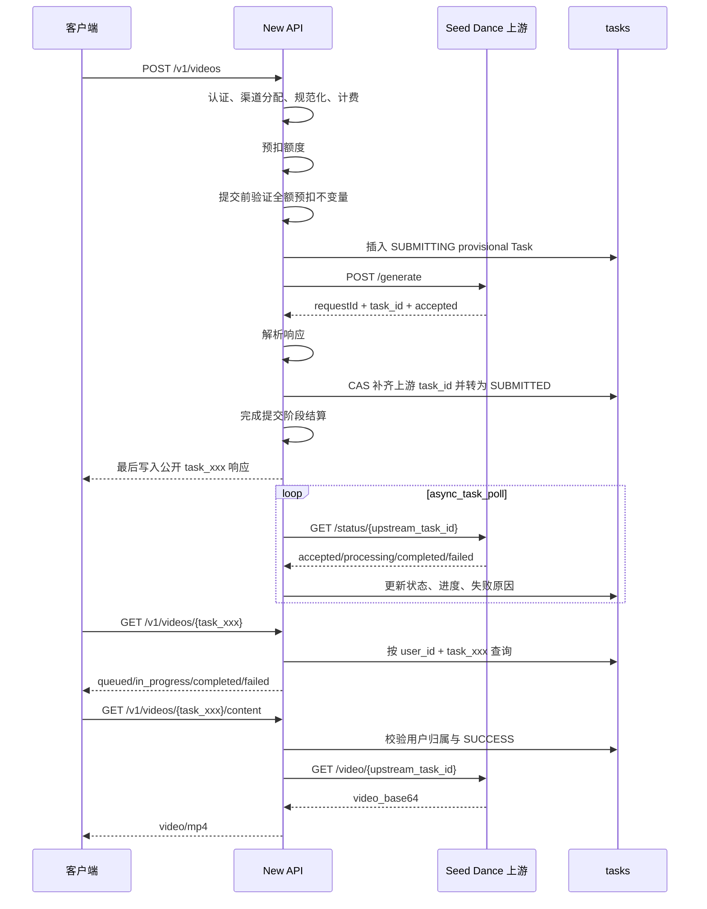

# 无审核 Seed Dance 异步视频渠道设计

日期：2026-07-24

状态：设计已确认并完成复核修订

目标仓库：`QuantumNous/new-api`

基线提交：`84a79b6807ac1a679ca86f34c8c6f39175c294d8`

## 1. 目标

为 New API 增加一个独立异步视频渠道：

```text
渠道显示名称：无审核 Seed Dance
公开模型名称：seedance-uncensored
```

客户端使用 New API 已有的 OpenAI 视频兼容接口：

```http
POST /v1/videos
GET  /v1/videos/{task_id}
GET  /v1/videos/{task_id}/content
```

适配器在内部映射到供应商接口：

```http
POST /generate
GET  /status/{upstream_task_id}
GET  /video/{upstream_task_id}
```

本功能必须完整复用 New API 的认证、渠道分配、模型映射、模型固定价格、模型倍率、分组倍率、预扣、提交结算、异步失败退款、任务超时退款和用户任务归属校验。

## 2. 供应商资料与现场证据

### 2.1 证据来源

用户提供的接口资料：

```text
本地只读来源：SOURCE_DOC_PATH（不提交到 Git）
SHA-256：4baebe2a397d2386905249f24b590b0c7654500fff473c140ec01c60476d1aa9
取得时间：2026-07-23（Asia/Shanghai）
```

该文件在本设计中称为“供应商提供资料”。它没有可识别的公开版本号或发布日期，因此本文只把文件中实际出现的字段作为资料契约，不把现场观察反向归因到资料。

现场测试时间为 2026-07-24，环境为目标服务器 `TARGET_HOST`。实施时新增脱敏证据：

```text
docs/api/fixtures/seed-dance/
├── generate-response.json
├── status-accepted.json
├── status-processing.json
├── status-completed.json
├── status-business-error.json
└── ffprobe-output.json
```

这些 fixture 不包含 API Key、图片 Base64、视频 Base64或可复用的供应商任务 ID。
它们是可提交、可供 CI 和 reviewer 复核的脱敏证据副本；本地原件继续以
SHA-256、取得日期和资料说明关联。若项目后续提供受控 evidence store，
再把相同 SHA-256 的原件登记为不可变制品，不把原始秘密或媒体提交到 Git。

### 2.2 供应商地址与传输行为

资料给出的基础地址：

```text
http://alb-o13xqj8f2cpjsa67ym.ap-northeast-1.alb.aliyuncsslbintl.com/v1/public_api/m-predict/polar4ai-i2v
```

2026-07-24 从目标服务器探测：

```text
HTTPS 443：连接超时
HTTP 80：服务可达并返回业务 HTTP 400
```

渠道 Base URL 保持可配置；供应商后续开放 HTTPS 时，管理员可直接切换，
不需要修改适配器。普通 HTTP 只允许用于 Mock、隔离协议探测或已经确认的
双方互信私网，不作为公网生产链路直接承载真实 Bearer Key、图片和视频。

真实生产流量启用前必须满足以下至少一项，并把满足项记录在部署验收单中：

1. 供应商 HTTPS 可用；
2. 服务器与供应商处于双方互信私网；
3. 流量经过 VPN 或等价加密隧道；
4. 流量经过位于可信边界内的受控 TLS 终止代理。

目标服务器上的最低成本真实请求也受该传输门禁约束；若部署时仍只有普通公网
HTTP，则完成代码、Mock、容器和禁用渠道部署验证，真实请求与渠道启用保持
待执行状态，不在命令行、日志或 Git 中暴露运行时 Key。

### 2.3 供应商提供资料中的请求契约

生成请求字段：

```json
{
  "image_base64": "",
  "prompt": "A white flower slowly rotating against a black background, static camera.",
  "resolution": "720P",
  "duration": 1,
  "prompt_optimization": false,
  "multi_shot": false,
  "strict_duration": true,
  "negative_prompt": ""
}
```

资料声明：

- `image_base64` 为空、`null` 或缺省时使用 T2V；
- 有图片时使用 I2V；
- 图片接受纯 Base64、`data:image/jpeg;base64,...` 或 `data:image/png;base64,...`；
- 图片格式为 JPG 或 PNG；
- 建议输入图片不超过 5 MB，这是一项建议而不是硬性最大值；
- 图片宽高范围为 `240–8000`；
- 图片宽高比范围为 `1:8–8:1`；
- 分辨率为 `480P`、`720P`、`1080P`；
- `480P` 只用于 I2V；
- 请求参数表声明 `duration` 范围为 `1–15`；
- 参数表在 duration 说明中另列一个孤立的 `15`，本设计据此推定缺省值为 `15`；
- 资料末尾示例脚本仍写 `[1,10]`，与参数表存在冲突；
- `strict_duration` 缺省为 `false`；
- 建议状态轮询间隔至少 5 秒；
- 资料状态为 `running`、`completed`、`failed`；
- 视频结果位于 `/video/{task_id}` 的 `video_base64` 字段；
- `video_base64` 可能是纯 Base64，也可能带 `data:video/mp4;base64,` 前缀；
- 截至该供应商资料版本，未发现视频 JSON、Base64 或解码 MP4 的最大尺寸声明。

首版以正式参数表为准，接受 `duration=1–15`，并采用推定缺省值 `15`。确定性的单元测试和 Mock 测试保护该决定；后续实时行为如明确拒绝 `11–15` 或显示不同缺省值，则按实时行为更新契约和文档。

### 2.4 现场观察

目标服务器真实请求观察到：

```text
accepted → processing → completed
```

兼容状态分组：

```text
资料明确：running、completed、failed
现场观察：accepted、processing、completed
防御兼容：queued
```

提交成功响应：

```json
{
  "requestId": "REQUEST_ID",
  "task_id": "UPSTREAM_TASK_ID",
  "status": "accepted"
}
```

状态查询每次会返回新的 `requestId`。稳定任务标识是 `task_id`，`requestId` 只用于单次 HTTP 调试关联。

现场观察到部分业务错误仍使用 HTTP 200：

```json
{
  "success": false,
  "errCode": "400",
  "errMessage": "{\"detail\":\"Task not found\"}",
  "data": null
}
```

因此，每个接口都必须同时判断 HTTP 状态与 JSON 业务字段。

真实内容响应：

```json
{
  "requestId": "...",
  "video_base64": "AAAAIGZ0eXBpc29tAAACAGlzb21pc28y..."
}
```

现场视频：

```text
本地只读样本：TEST_ARTIFACT_PATH（不提交到 Git）
SHA-256：1c48470a46b851bcfdd0a1ca744818de5d53a2c9118eee3623c3c59cc0e23db4
```

已验证输出为 MP4，视频编码 H.264、音频编码 AAC。请求 `duration=1` 且 `strict_duration=true` 时，真实媒体时长仍约为 2.02 秒。因此计费使用规范化后的请求时长，不使用最终媒体时长。

## 3. 范围

### 3.1 本次包含

- 独立渠道类型与渠道注册；
- 独立 `TaskAdaptor`；
- 向后兼容的延迟任务成功响应接口；
- 向后兼容的 context-aware 任务轮询接口；
- OpenAI 视频提交、查询和内容下载；
- T2V 与单图 I2V；
- JSON 与 multipart 请求；
- 请求参数规范化；
- 模型固定价格和模型倍率兼容；
- 时长和分辨率附加倍率；
- 分组倍率；
- 预扣、失败退款和超时退款；
- 按需获取 Base64 视频并输出 MP4；
- OpenAI 视频路由专用错误结构与 404 语义；
- 渠道专用连通性测试；
- 前端渠道配置和国际化；
- Markdown 测试文档；
- 可导入 Apifox 的 OpenAPI 3.0.3 文件；
- 本地、Mock、容器和服务器真实端到端验证；
- GitHub 中介更新和服务器 Docker 部署。
- 生产传输门禁与禁用状态部署验证。

### 3.2 本次不包含

- 新增供应商原生公开路由；
- 多图视频输入；
- 视频 Base64 持久化到数据库；
- 视频对象存储归档；
- 新增任务表或数据库迁移；
- 改造整个异步任务账务系统；
- 改变旧 `/v1/video/generations` 的错误兼容行为；
- 将 MP4 实际时长作为计费依据；
- 在没有供应商价格证据时按最终 token 重新计费；
- 额外创建昂贵的真实 I2V、1080P 或 15 秒验收任务。

## 4. 方案选择

选择“独立异步任务适配器 + 通用视频内容获取接口”。

未选择的方案：

1. 在现有 Doubao/Seedance 适配器中增加第二套协议分支。该方案会把两套鉴权、提交、状态和内容协议耦合在同一包中。
2. 新增供应商原生 Controller 和路由。该方案会重复实现认证、渠道分配、计费、任务、轮询和退款。

独立适配器能够复用核心能力，同时保持供应商协议边界清晰。

## 5. 总体架构



## 6. 渠道与组件

### 6.1 渠道常量

在当前基线提交上新增：

```go
ChannelTypeSeedDance = 59
ChannelTypeDummy
```

`ChannelTypeDummy` 必须继续位于所有实际渠道之后。

渠道属性：

```text
后端渠道名：seed-dance
前端显示名：无审核 Seed Dance
模型：seedance-uncensored
Endpoint Type：openai-video
```

`ChannelBaseURLs[59]` 使用供应商基础地址，管理员可在渠道配置中覆盖。

涉及：

```text
constant/channel.go
common/endpoint_type.go
relay/relay_adaptor.go
controller/channel-test.go
```

提交生命周期的向后兼容核心改动涉及：

```text
relay/channel/adapter.go
relay/common/relay_info.go
relay/relay_task.go
controller/relay.go
model/task.go
model/system_task.go
service/task_polling.go
controller/system_task_handlers.go
```

### 6.2 Seed Dance TaskAdaptor

新增：

```text
relay/channel/task/seedance/
├── adaptor.go
├── billing.go
├── constants.go
├── content.go
├── content_json.go
├── dto.go
├── http.go
├── image.go
├── normalize.go
├── adaptor_test.go
├── billing_test.go
├── content_test.go
└── normalize_test.go
```

职责：

- `adaptor.go`：提交、轮询、状态转换和 OpenAI 视频响应转换；
- `billing.go`：从规范化对象返回 `OtherRatios`；
- `constants.go`：模型、状态、默认值、分辨率和超时；
- `content.go`：内容请求、严格 Base64 解码、MP4 验证和临时文件生命周期；
- `content_json.go`：流式提取并脱敏 `video_base64` JSON 字符串；
- `dto.go`：供应商请求、提交响应、状态响应和业务错误字段；
- `http.go`：克隆 Transport、保留代理并应用连接和阶段 deadline；
- `image.go`：图片来源解析、远程获取、格式、尺寸、比例与 SHA-256 去重；
- `normalize.go`：Raw JSON、multipart 与单一规范化对象；
- 测试文件保护参数、协议、状态和计费契约。

适配器实现：

```text
Init
ValidateRequestAndSetAction
EstimateBilling
AdjustBillingOnSubmit
AdjustBillingOnComplete
BuildRequestURL
BuildRequestHeader
BuildRequestBody
DoRequest
DoResponse
FetchTask
ParseTaskResult
ConvertToOpenAIVideo
GetModelList
GetChannelName
```

适配器嵌入 `taskcommon.BaseBilling`，复用提交后和完成后的无调整实现，并覆盖 `EstimateBilling`。供应商没有返回比规范化请求更可信的计费参数。

### 6.3 提交前计费门禁、持久化 provisional Task 与延迟成功响应

增加向后兼容的可选接口：

```go
type FullPrepaidTaskSubmitter interface {
    RequiresFullPrepaidBilling() bool
}

type DurableTaskSubmitter interface {
    RequiresDurableTaskBeforeSubmit() bool
}

type DeferredTaskSubmitResponder interface {
    BuildTaskSubmitResponse(
        info *relaycommon.RelayInfo,
        taskData []byte,
    ) (*TaskSubmitHTTPResponse, error)
}

type TaskSubmitHTTPResponse struct {
    StatusCode      int
    Body            any
    InitialStatus   model.TaskStatus
    InitialProgress string
}
```

`TaskSubmitResult` 增加可选的 `HTTPResponse *TaskSubmitHTTPResponse`。Seed Dance
的 `DoResponse` 只解析供应商响应，不调用 `c.JSON`；`RelayTaskSubmit` 对
可选接口做类型断言，使用已预生成的 `RelayInfo.PublicTaskID` 构造安全的
公开响应并放入 `TaskSubmitResult`。

Seed Dance 同时实现 `FullPrepaidTaskSubmitter` 和 `DurableTaskSubmitter`，
两个方法都返回 `true`。核心在价格计算和全额预扣完成后、调用
`BuildRequestBody` 和 `DoRequest` 之前验证“全额预扣、提交后零调整”
不变量：

```text
免费任务：
  info.PriceData.Quota == 0
  relayInfo.Billing == nil

付费任务：
  relayInfo.Billing != nil
  info.PriceData.Quota == relayInfo.Billing.GetPreConsumedQuota()
```

不变量不成立时返回 `seedance_billing_invariant_failed`、
`Retryable=false`，不构建或发送 `/generate`，不插入 Task，不写消费成功
日志，并走尚未结算的请求级退款。这样不会出现“供应商任务已经创建，随后才
发现预扣不变量不成立”的不可追踪窗口。

为消除“供应商已经创建任务，但随后 `Task.Insert` 失败”的窗口，增加内部
状态：

```go
const TaskStatusSubmitting TaskStatus = "SUBMITTING"
```

以及仅用于同一请求多渠道尝试的 `TaskRelayInfo` 字段：

```go
PersistentTaskID  int64
RefundOwnedByTask bool
```

`TaskStatusSubmitting` 不需要数据库迁移，仍保存到现有 `status` varchar。
普通异步轮询批次 `GetAllUnFinishSyncTasks` 必须排除该状态，且不得把缺少
`PrivateData.UpstreamTaskID` 的 provisional Task 通过历史兼容逻辑当成公开
`TaskID` 去请求供应商。`HasTaskPollingWork` 仍把 `SUBMITTING` 视为需要调度
的工作，超时 sweep 也仍包含该状态，以便进程在提交期间退出后，即使系统中
没有其他视频任务，调度器仍会在超时后把它转为 `FAILURE / 100%` 并退款。

在请求体已经成功构建、但尚未执行任何网络 I/O 时，核心为 Seed Dance
首次插入 provisional Task：

```text
TaskID       = RelayInfo.PublicTaskID
Status       = SUBMITTING
Progress     = 0%
Quota        = 已验证的全额预扣 quota
ChannelId    = 本次实际渠道
PrivateData.Key
             = 本次实际选中的单个 Key
PrivateData.BillingContext
             = 本次价格、分组倍率、时长和分辨率快照
PrivateData.UpstreamTaskID
             = 空
```

插入失败发生在 `/generate` 前：立即返回本地持久化错误，
`RefundOwnedByTask` 保持 `false`，由请求级 defer 退款，且供应商调用次数为零。
插入成功后立即设置：

```text
PersistentTaskID  = Task.ID
RefundOwnedByTask = true
```

从这一刻开始，该 Task 是唯一退款 owner；请求级 defer 不再调用
`Billing.Refund`。若明确 429 且供应商确认没有创建任务并允许切换渠道，下次
尝试通过 `id + user_id + task_id + status=SUBMITTING` 的 CAS 更新同一行的
`ChannelId`、实际 Key 和计费快照，不插入第二行。CAS 更新失败时不得发送新的
`/generate`。

Controller 对验证通过且非空的 `HTTPResponse` 采用：

```text
完成全额预扣门禁
→ 构建上游请求体
→ 插入或 CAS 刷新 SUBMITTING provisional Task
→ POST /generate
→ 解析供应商成功响应
→ 优先持久化供应商 task_id 和清理后的 Task.Data，状态仍为 SUBMITTING
→ 防御性重验最终 quota 与预扣 quota 相等
→ 构造公开成功响应
→ CAS 把任务最终化为 SUBMITTED 和 10%
→ 以相同 quota 完成零 delta 的 SettleBilling
→ 写消费日志
→ 最后向客户端写 200
```

收到完整响应并解析出非空上游 ID 后，任何计费、防御性检查、响应构造或状态
最终化之前，先调用：

```go
func AttachTaskUpstreamResult(
    id int64,
    publicTaskID string,
    upstreamTaskID string,
    taskData []byte,
) (*Task, error)
```

该方法直接访问主数据库，在事务内锁定 `id + task_id` 对应行，完整更新现有
`private_data` JSON 和清理后的 `Data`，但保持 `Status=SUBMITTING`、
`Progress=0%`。若数据库中的上游 ID 为空则写入；若与传入值相同则幂等成功；
若已存在不同 ID 则返回关联冲突并绝不覆盖；若任务已处于失败或成功终态也不
覆盖终态。写返回错误后必须从主库 read-after-error：若相同上游 ID 已存在，
按成功处理；否则使用相同 public/upstream ID 有限重试，绝不再次调用
`/generate`。

上游关联成功持久化、防御性不变量和公开响应构造都成功后，再调用：

```go
func CommitTaskSubmission(
    id int64,
    publicTaskID string,
) (*Task, error)
```

它只允许 `id + task_id + status=SUBMITTING` 转为
`Status=SUBMITTED`、`Progress=10%`；重复调用且已经是
`SUBMITTED / 10%` 时幂等成功；若 timeout sweep 已把任务转为
`FAILURE`，不得复活。这样完成状态的 CAS 失败时，上游关联仍已独立保存。
客户端只有在关联持久化、最终化 CAS、零 delta 结算和消费日志都成功后才收到
公开 ID，因此收到 ID 时任务一定可查询。

若附加上游关联或完成提交的 CAS 暂时失败，核心进行有限、带退避且服从请求
context 的持久化重试；仍失败时：

- 不返回 200，不写消费成功日志；
- provisional Task 保留非零 quota 和任务级退款所有权；
- 尝试把它 CAS 为 `FAILURE / 100%`，不得删除审计行；
- 创建 `SystemTaskTypeSeedDanceSubmitReconciliation` 管理员一致性记录，记录
  public task ID、上游 task ID、Task 主键、channel ID、node name、时间和
  脱敏错误 code，不记录 Key、prompt、图片、Base64 或完整供应商响应；
- 一致性记录的处理器只负责幂等补写 `AttachTaskUpstreamResult`，随后确保
  仍处于 `SUBMITTING` 的同一 Task 进入 `FAILURE / 100%` 并走任务级退款；
  它不把已经向客户端返回失败的提交改成 `SUBMITTED`，也不复活任何终态。
  上游关联与记录继续保留供管理员对账；
- 若数据库整体持续不可写，输出不含 Key 和媒体的 critical 事件并保留内存中
  的关联直到请求结束。供应商没有幂等键或按客户端 ID 查询接口，因此在
  “进程恰好于收到供应商 ID 后崩溃且所有本地持久化同时不可用”的故障模型下，
  任何仅依赖本地数据库的实现都不能数学上保证 ID 永不丢失；provisional Task
  和一致性记录消除正常 `Task.Insert` orphan，并把剩余灾难性故障变成显式
  管理员告警。

当前 `BillingSession.Settle` 在 delta 为零时只在锁内标记 settled，不调用
钱包、订阅或 Token 存储，所以不会出现“资金来源已结算、Token 调整失败”的
部分提交状态。供应商成功后的 quota 检查只是防御性断言；若它异常，不能再
退回到请求级退款，也不能丢弃已经持久化的供应商关联。

若零 delta 结算仍异常返回错误，说明实现不变量或计费会话契约已被破坏：

- 不删除已经插入的审计 Task；
- 通过状态 CAS 把该 Task 标记为 `FAILURE / 100%`，保留非零 `Task.Quota`
  作为退款对账标记，并记录不含秘密的内部 reconciliation code；
- `RefundOwnedByTask` 已在 provisional Task 插入成功时设置，请求 defer 不调用
  `Billing.Refund`；
- 由持久化 Task 路径调用 `RefundTaskQuota`；退款成功把 `Task.Quota` 清零，
  失败则保留 quota 供既有 reconciliation sweep 重试；
- 请求级退款与任务级退款互斥，绝不同时执行；
- 不向客户端发送成功 ID，也不写成功消费日志。

这样不会形成请求级和任务级双退，也不会在正常数据库可写路径中删除唯一的
上游任务关联。其他已有 `TaskAdaptor` 没有实现这些可选接口时保持现有响应
顺序。

### 6.4 提交失败分类与显式重试语义

增加向后兼容的可选接口：

```go
type TaskSubmitFailureClassification struct {
    TaskError      *dto.TaskError
    UpstreamTaskID string
    TaskData       []byte
}

type TaskSubmitFailureClassifier interface {
    ClassifyTaskSubmitFailure(
        resp *http.Response,
        requestErr error,
    ) *TaskSubmitFailureClassification
}
```

`dto.TaskError` 增加仅供内部控制流使用的：

```go
Retryable *bool `json:"-"`
```

`RelayTaskSubmit` 在把 `DoRequest` error 包装成通用错误之前，以及在读取非
2xx Body 之前，先调用该可选分类器。分类器负责安全消费并关闭自己读取的错误
响应 Body；旧适配器未实现时继续走当前通用包装。`TaskData` 必须是清理后的
小对象。分类结果带有非空 `UpstreamTaskID` 时，核心先调用
`AttachTaskUpstreamResult`，再返回 `TaskError`；该 ID 不进入客户端错误或
日志。Seed Dance 的 `TaskError` 必须原样传到 `shouldRetryTaskRelay`，后者
先尊重非空 `Retryable`，再回退现有 HTTP 状态规则。

Seed Dance 的明确分类为：

- 网络超时、EOF、连接中断、响应读取失败和 502/503/504：
  `seedance_submit_outcome_unknown`、`Retryable=false`；
- 401/403：`upstream_authentication_error`、`Retryable=false`；
- 参数和明确业务错误：`upstream_invalid_request` 或
  `upstream_business_error`、`Retryable=false`；
- 429 只有在完整错误响应明确表示限流、根对象和 `data` 都没有任务 ID，
  且业务字段确认没有创建任务时，才返回
  `upstream_rate_limit_error`、`Retryable=true`；
- 429 含任务 ID、缺少可确认未创建任务的业务字段或响应解析不完整时，
  仍按 `seedance_submit_outcome_unknown`、`Retryable=false`。

分类器不把完整响应体或供应商任务 ID 写入客户端错误和日志。

HTTP 2xx 之后的 `DoResponse` 同样必须显式设置重试语义，不能把读取或解析
错误包装成 `Retryable=nil` 的普通 500：

- HTTP 200 Body 读取中断、截断 JSON、非法 JSON、成功形状缺少非空
  `task_id`，以及无法确定是否已经创建任务的业务形状，一律返回
  `seedance_submit_outcome_unknown`、`Retryable=false`；
- HTTP 200 中完整且明确的参数或业务失败返回
  `upstream_invalid_request` 或 `upstream_business_error`、
  `Retryable=false`；
- 只有完整解析出非空 `task_id` 且业务成功才返回成功结果；
- `DoResponse` 即使同时返回 `TaskError`，只要从完整响应中可靠解析出了
  `task_id`，也必须把 `taskID` 和清理后的 `taskData` 一并返回；核心先附加
  上游关联，再处理错误；
- 上述任一失败都必须关闭 Body，且故障注入测试断言 `/generate` 调用次数
  严格为 1。

### 6.5 Context-aware 轮询

保留现有 `FetchTask` 接口，并增加可选接口：

```go
type TaskFetcherWithContext interface {
    FetchTaskWithContext(
        ctx context.Context,
        baseURL string,
        key string,
        body map[string]any,
        proxy string,
    ) (*http.Response, error)
}
```

`service.updateVideoSingleTask` 优先调用该接口，旧适配器回退到原
`FetchTask`。Seed Dance 实现两个方法，旧方法使用固定 30 秒背景 context
作为兼容入口，正常后台轮询使用调度器 context。

### 6.6 通用 VideoContentFetcher

在任务渠道公共接口层增加可选接口：

```go
type VideoContentFetcher interface {
    FetchVideoContent(
        ctx context.Context,
        baseURL string,
        key string,
        upstreamTaskID string,
        proxy string,
    ) (*VideoContent, error)
}

type VideoContent struct {
    ContentType   string
    ContentLength int64
    Body          io.ReadCloser
}

type VideoContentError struct {
    StatusCode int
    Type       string
    Code       string
    Message    string
    Cause      error
}

func (e *VideoContentError) Error() string
func (e *VideoContentError) Unwrap() error
```

`ContentLength=-1` 表示长度未知。

`FetchVideoContent` 的失败仍通过 `error` 返回，但 Seed Dance 的具体错误必须
是 `*VideoContentError`。`Message` 是允许返回客户端的脱敏文本，`Cause`
只写内部日志。`VideoProxy` 使用 `errors.As` 取得 HTTP、type 和 code；
HTTP 200 业务失败也使用该结构，无法识别的普通 error 固定回退为脱敏 502。
在 fetcher 成功返回前 Controller 不写任何响应头。

`controller.VideoProxy` 按任务 `Platform` 获取 `TaskAdaptor`，对 `VideoContentFetcher` 做类型断言。Seed Dance 走该接口；现有 Gemini、Vertex、Sora 和 URL 代理路径保持原行为。

该边界把供应商内容协议留在适配器内，避免在 Controller 中继续增加渠道类型分支。

内容请求的 Base URL 先取 `constant.ChannelBaseURLs[channel.Type]`，再由渠道自定义 Base URL 覆盖；Seed Dance 不使用当前 Controller 中面向 OpenAI 的默认回退地址。渠道代理设置同步传给 `FetchVideoContent`。

## 7. 数据存储

不新增表和字段，复用现有 `Task`：

```text
Task.TaskID
  = New API 公开 task_xxx

Task.PrivateData.UpstreamTaskID
  = 供应商 task_id

Task.PrivateData.BillingContext
  = 提交时的价格和倍率快照

Task.PrivateData.ResultURL
  = /v1/videos/{public_task_id}/content

Task.PrivateData.Key
  = 本次提交实际选中的单个渠道 Key
```

`Task.Data` 只保存体积较小、经过供应商适配器清理的提交或状态响应。清理结果不包含供应商 `task_id`、API Key、图片 Base64 或视频 Base64。供应商任务 ID 只保存在 `Task.PrivateData.UpstreamTaskID`。

Seed Dance 使用第 6.3 节的延迟响应路径：

```text
提交前插入 SUBMITTING、进度 0% 的 provisional Task
→ POST /generate
→ DoResponse 只解析
→ 优先幂等附加 upstream task ID 和清理后的 Data
→ 单独 CAS 最终化为 SUBMITTED 和 10%
→ 零 delta SettleBilling 成功
→ 消费日志成功
→ 最后向客户端返回 200
```

因此客户端收到成功 `task_id` 时，该任务已经可查询。provisional
`Task.Insert` 失败发生在供应商调用前，不返回成功 `task_id`，并由尚未转移
所有权的请求级退款恢复全额预扣。

provisional Task 插入成功后，所有提交、持久化和零 delta `SettleBilling`
异常都属于任务级退款或一致性故障；按第 6.3 节保留失败 Task、可取得的上游
关联与管理员 reconciliation 记录，由任务级退款独占处理，禁止请求级退款
形成双退。`TaskStatusSubmitting` 不进入普通状态轮询，但仍进入超时回收。

提交阶段通过 `ContextKeyChannelKey` 取得本次实际选中的单个 Key，并保存到现有 `Task.PrivateData.Key`，行为与 Gemini/Vertex 的任务归属方式一致。轮询和内容下载优先使用任务保存的 Key，避免多 Key 渠道把完整 Key 集合当成 Bearer Token，也避免轮换后历史任务改用错误凭据。该值属于数据库私有 JSON：

- 不返回客户端；
- 不写日志或 fixture；
- 不新增数据库列；
- 渠道配置中移除或禁用该 Key 后，历史任务的状态请求按渠道配置错误处理，不自动改用另一 Key；
- 渠道删除后，恢复相同渠道和 Key 才能继续处理历史任务。

轮询和内容下载共同使用：

```go
func ResolveStoredTaskKey(
    channel *model.Channel,
    storedKey string,
) (string, error)
```

该 helper 对单 Key 要求当前 `channel.Key` 与保存值一致；对多 Key 使用
`channel.GetKeys()` 查找保存值，并确认对应索引在
`MultiKeyStatusList` 中仍为启用或缺省启用。找不到、已禁用或保存值为空都返回
结构化渠道配置错误，不回退到其他 Key，也不把 Key 放进错误文本或日志。

## 8. 客户端请求契约

推荐 JSON：

```json
{
  "model": "seedance-uncensored",
  "prompt": "一朵白色花朵在黑色背景前缓慢旋转，固定镜头",
  "duration": 10,
  "size": "1280x720",
  "image": "",
  "metadata": {
    "prompt_optimization": true,
    "multi_shot": false,
    "strict_duration": false,
    "negative_prompt": ""
  }
}
```

接受：

- `application/json`；
- `multipart/form-data`；
- T2V；
- 单张 I2V；
- 图片纯 Base64；
- 图片 data URI；
- 通过 SSRF 防护客户端获取的 JPG/PNG HTTP 图片；
- multipart `input_reference` 文件。

## 9. 单一规范化对象

Seed Dance 不依赖通用 `TaskSubmitReq.Duration int` 或 `ValidateBasicTaskRequest` 完成最终解析，因为它们不能完整保留字段缺省、JSON `null`、显式 `0` 和非法数字之间的区别。

JSON 请求先使用保留字段存在性的 Raw DTO：

```go
type seedDanceRawJSONRequest struct {
    Model          json.RawMessage `json:"model"`
    Prompt         json.RawMessage `json:"prompt"`
    Duration       json.RawMessage `json:"duration"`
    Seconds        json.RawMessage `json:"seconds"`
    Size           json.RawMessage `json:"size"`
    Image          json.RawMessage `json:"image"`
    Images         json.RawMessage `json:"images"`
    InputReference json.RawMessage `json:"input_reference"`
    Metadata       json.RawMessage `json:"metadata"`
}
```

实际反序列化通过项目 `common.Unmarshal` 完成；不直接调用标准库 `json.Unmarshal`。`json.RawMessage == nil` 表示缺省，内容为 `null` 表示显式 JSON null，两者对可选字段都按“未设置”处理。显式零、空字符串、非数字和小数仍属于已设置的非法值并返回 400。

multipart 请求通过：

```go
common.ParseMultipartFormReusable(c)
```

读取 `form.Value` 和 `form.File["input_reference"]`，包括 `duration`、`seconds`、结构化 `metadata`、文件和布尔字符串。请求第一次进入 `ValidateRequestAndSetAction` 时生成单一规范化对象：

成功取得 `*multipart.Form` 后立即注册 `form.RemoveAll()`；规范化成功、参数
错误和客户端取消路径都必须执行。缓存中只保存已经规范化的字符串和图片字节
结果，不保存 `FileHeader` 或文件 reader，后续渠道重试不再创建 multipart
临时文件。

```go
type NormalizedRequest struct {
    Prompt             string
    ImageBase64        string
    Resolution         string
    Duration           int
    PromptOptimization *bool
    MultiShot          *bool
    StrictDuration     *bool
    NegativePrompt     string
}
```

可选布尔字段使用指针，以区分“缺省”和显式 `false`。缺省字段不强制覆盖供应商默认值。

规范化对象保存在 Gin context，并同时供：

```text
ValidateRequestAndSetAction
EstimateBilling
BuildRequestBody
```

后续渠道重试再次进入 `ValidateRequestAndSetAction` 时先检查缓存，命中后直接复用，不再次读取 multipart 文件、不再次下载远程图片，也不再次解码 Base64。`EstimateBilling` 和 `BuildRequestBody` 只能读取缓存的规范化对象，不回读原始请求。这样实际发送参数与计费参数完全一致。

## 10. 参数规则

### 10.1 Prompt

- 去除首尾空白后必须非空；
- 供应商请求使用规范化后的值；
- `metadata` 不覆盖顶层 `prompt`。

### 10.2 Duration

接受：

```text
duration
seconds
metadata.duration
```

规则：

- 多个字段同时存在且数值相同：接受；
- 多个字段数值不同：返回 `400 invalid_duration`；
- JSON 整数和只包含十进制数字的字符串（例如 `10`、`"10"`）：接受；
- 有效范围：`1–15`；
- 缺省值：`15`；
- JSON `null`：按未设置处理；
- 显式零、空字符串、负数、小数、指数形式、非数字和大于 15：返回 400；
- 通用 `MaxTaskDurationSeconds` 仍作为第二层防御；
- 计费使用规范化后的请求值。

### 10.3 Resolution

接受：

```text
metadata.resolution
size
```

映射：

```text
854x480 / 480x854      → 480P
1280x720 / 720x1280    → 720P
1920x1080 / 1080x1920  → 1080P
```

规则：

- 缺省值：`720P`；
- 大小写不敏感；
- `metadata.resolution` 与 `size` 映射结果不同时返回 `400 invalid_resolution`；
- 未识别尺寸返回 400；
- T2V + `480P` 返回 400；
- I2V 接受全部三个分辨率。

### 10.4 Image

解析顺序：

```text
multipart input_reference
→ input_reference
→ image
→ images[0]
→ metadata.image_base64
```

多个位置提供相同图片时归一化为一张。多个位置提供不同图片或 `images` 包含多张图片时返回 400。

“相同图片”通过规范化解码后字节的 SHA-256 判断，不比较来源字符串。data URI 只接受：

```text
data:image/jpeg;base64,...
data:image/png;base64,...
```

图片校验：

```text
MIME：image/jpeg、image/png
最小宽高：240×240
最大宽高：8000×8000
宽高比：1:8–8:1
```

供应商资料中的 `5 MB` 仅在 Markdown 中作为建议展示，不作为 Seed Dance 专用硬拒绝条件。远程图片通过 New API SSRF 防护客户端获取，每次重定向重新校验，并沿用 New API 平台已有的通用远程资源配置；本功能不增加专用 `5 MB`/`5 MiB` 输入上限。

### 10.5 供应商扩展参数

以下字段位于 `metadata`：

```text
prompt_optimization
multi_shot
strict_duration
negative_prompt
```

布尔字段必须是布尔值；字符串 `"true"` 或 `"false"` 只在 multipart 表单规范化阶段转换。`negative_prompt` 必须是字符串。

这些参数没有供应商独立价格依据，不增加额外计费倍率。

## 11. 提交与公开响应

适配器向供应商发送：

```http
POST {baseURL}/generate
Authorization: Bearer {channel_key}
Content-Type: application/json
```

供应商返回：

```json
{
  "requestId": "...",
  "task_id": "...",
  "status": "accepted"
}
```

New API 保存供应商 `task_id`，向客户端只返回公开任务 ID：

```json
{
  "id": "task_xxx",
  "task_id": "task_xxx",
  "object": "video",
  "model": "seedance-uncensored",
  "status": "queued",
  "progress": 10
}
```

`DoResponse` 返回给任务落库逻辑的 `taskData` 使用清理后的最小结构，例如：

```json
{
  "requestId": "...",
  "status": "accepted",
  "model": "seedance-uncensored",
  "seconds": "10",
  "size": "1280x720"
}
```

其中不包含供应商 `task_id`。

`ConvertToOpenAIVideo` 不把供应商原始 `Task.Data` 直接返回给客户端，而是从以下受控字段重新构造 `dto.OpenAIVideo`：

```text
Task.TaskID
Task.Status
Task.Progress
Task.SubmitTime / StartTime / FinishTime
Task.Properties.OriginModelName
Task.PrivateData.BillingContext.OtherRatios
Task.FailReason
```

`seconds` 从计费快照的 `seconds` 读取；分辨率倍率反向映射到 `480P`、`720P`、`1080P` 的规范尺寸。这样后台轮询覆盖 `Task.Data` 后，状态接口仍稳定返回公开字段，也不会泄露供应商响应。

## 12. 状态轮询

复用现有 `async_task_poll`，默认约每 15 秒：

```http
GET {baseURL}/status/{upstream_task_id}
Authorization: Bearer {channel_key}
```

状态映射：

| 供应商状态 | New API 状态 | OpenAI 状态 | 进度 |
|---|---|---|---:|
| `accepted` | `SUBMITTED` | `queued` | 10% |
| `queued` | `QUEUED` | `queued` | 20% |
| `running` | `IN_PROGRESS` | `in_progress` | 30% |
| `processing` | `IN_PROGRESS` | `in_progress` | 30% |
| `completed` | `SUCCESS` | `completed` | 100% |
| `failed` | `FAILURE` | `failed` | 100% |

规则：

- 明确 `failed` 才进入失败终态；
- 瞬时网络错误保持原状态，下一轮重试；
- 未知状态由 `ParseTaskResult` 返回可重试解析错误，通用轮询器保留数据库原状态；不得返回空状态，否则通用状态机会把任务错误地标记为失败；
- 最终由 New API 任务超时机制结束长期异常任务；
- 轮询阶段不调用 `/video`；
- 成功任务的结果 URL 指向本地 `/v1/videos/{public_task_id}/content`。

`FetchTask` 在把响应交给通用轮询层之前先解析业务错误，再生成供应商响应的
清理副本。副本只保留：

```text
requestId
success
errCode
errMessage
status
message
```

它移除供应商 `task_id`、`optimized_prompt` 以及任何 Base64 字段，避免通用
轮询日志记录供应商优化后的用户 prompt。`ParseTaskResult` 解析该清理副本，
通用轮询日志与 `Task.Data` 都不接触原始供应商任务 ID、prompt 或媒体内容。

## 13. 内容下载

客户端：

```http
GET /v1/videos/{public_task_id}/content
```

New API 校验：

```text
任务存在
任务属于当前用户
任务状态为 SUCCESS
渠道存在
上游 task_id 非空
```

供应商请求：

```http
GET {baseURL}/video/{upstream_task_id}
Authorization: Bearer {channel_key}
```

支持：

```json
{"video_base64":"AAAAIGZ0..."}
```

和：

```json
{"video_base64":"data:video/mp4;base64,AAAAIGZ0..."}
```

处理：

- 使用客户端 request context 派生下载 deadline，并在客户端断开时取消上游请求；
- 不使用 `io.ReadAll` 把供应商响应载入内存，也不把完整
  `video_base64` 反序列化为单个 `string` 或 `[]byte`；
- 先创建权限为 `0600` 的原始响应、脱敏 JSON、Base64 文本和解码 MP4
  临时文件；Linux 上打开后立即 `unlink`，其他平台在关闭时显式删除；
- 使用 `io.Copy` 把上游 Body 完整写入原始响应文件，完成后 `seek` 回开头；
- 通过支持 JSON 字符串转义的流式提取器遍历完整根对象：把唯一的
  `video_base64` 字符串逐字节反转义到 Base64 临时文件，同时向脱敏 JSON
  文件写入空字符串占位；重复字段、非字符串值、非法转义和不完整 JSON 都失败；
- 对脱敏 JSON 使用 `common.DecodeJson` 完整校验结构，并检查 HTTP 状态以及
  `success`、`errCode`、`errMessage`、`status`、`message` 等业务字段；
- 业务验证通过后识别 Base64 临时文件开头的可选
  `data:video/mp4;base64,` 前缀；其他 data URI MIME 失败；
- 使用严格 Base64 解码器从 Base64 临时文件边读取、边写入解码 MP4
  临时文件，直到 EOF；任何尾部非法字符都在响应头发出前被发现；
- 校验完整解码结果包含有效 MP4 `ftyp`；
- `seek` 回文件开头，并以实际解码文件长度设置 `Content-Length`；
- 只有全部验证成功后才写 200 响应头，然后从临时文件流式输出；
- 成功、业务失败、JSON 提取失败、解码失败、超时和客户端取消都关闭并清理
  全部临时文件；
- 不设置 Seed Dance 专用 JSON、Base64 或 MP4 大小上限；
- 沿用部署环境已有的 HTTP、反向代理、文件描述符、内存和磁盘资源约束；
- 将来供应商发布明确限制时，再采用供应商值。

上述流程不把完整 JSON、完整 Base64 字符串和解码视频同时物化到内存，也
没有重新引入供应商资料未声明的大小阈值。Base64、解码 MP4 和临时文件路径
不写入数据库或日志，临时文件不作为长期缓存或归档。

响应：

```http
Content-Type: video/mp4
Content-Disposition: inline; filename="{public_task_id}.mp4"
Cache-Control: private, max-age=3600
X-Content-Type-Options: nosniff
```

## 14. 计费

### 14.1 推荐模式

推荐使用 `ModelPrice`，其含义是：

```text
720P 每请求秒基础价格
```

定义：

```text
P = ModelPrice
D = 规范化后的请求时长
R = 分辨率倍率
G = 核心解析出的最终分组倍率
Q = QuotaPerUnit，当前为 500000
```

公式：

```text
费用 = P × D × R × G
quota = P × D × R × G × Q
```

部署测试初始配置：

```text
ModelPrice["seedance-uncensored"] = 0.15
```

该值用于首版测试和上线基线，管理员可在后台修改。

### 14.2 分辨率倍率

已确认：

```text
480P  = 0.5
720P  = 1.0
1080P = 2.25
```

`EstimateBilling` 返回：

```json
{
  "seconds": 10,
  "resolution": 2.25
}
```

### 14.3 ModelRatio 兼容

如果没有 `ModelPrice`，但管理员配置：

```text
ModelRatio["seedance-uncensored"] = M
```

则沿用 New API 当前异步任务语义：

```text
quota = M / 2 × D × R × G × Q
```

如果两种配置同时存在，`ModelPrice` 优先。值为零沿用现有免费模型语义。

代码不把猜测价格或中性倍率写入全局默认价格表。部署时在现有运行时价格 Map 中增加 `ModelPrice=0.15`，保留其他模型配置。这样管理员随后可删除固定价格并切换到 ModelRatio。

### 14.4 分组倍率

适配器不重复计算分组折扣。核心规则：

```text
存在 UserGroup → UsingGroup 特殊倍率时使用特殊倍率；
否则使用 UsingGroup 普通倍率。
```

提交时解析出的最终倍率写入 `BillingContext.GroupRatio`。

### 14.5 安全换算

- 所有用户控制的时长在计费前限制到 `1–15`；
- 分辨率只从显式枚举读取；
- 使用 `PriceData.AddOtherRatio`；
- 使用 `common.QuotaFromFloatChecked`；
- 配额钳制事件进入管理员审计信息；
- `seedance-uncensored` 不加入 `TASK_PRICE_PATCH`。

### 14.6 生命周期

```text
规范化请求
→ 计算完整额度
→ 强制全额预扣
→ 提交供应商
```

提交失败时退回预扣。供应商明确失败或任务超时时，通过现有终态 CAS 和 `RefundTaskQuota` 退款。成功时保留提交额度：

- 不按最终 MP4 时长重算；
- 不构造虚假 token；
- 不按不存在的供应商 usage 结算；
- `BillingContext` 保存提交时的价格和倍率快照。

响应头：

```http
X-New-Api-Other-Ratios: {"seconds":10,"resolution":2.25}
```

### 14.7 示例

使用：

```text
ModelPrice = 0.15
GroupRatio = 1
```

| 请求 | 费用 | quota |
|---|---:|---:|
| 5 秒、480P | $0.375 | 187500 |
| 5 秒、720P | $0.75 | 375000 |
| 5 秒、1080P | $1.6875 | 843750 |
| 15 秒、720P | $2.25 | 1125000 |
| 15 秒、1080P | $5.0625 | 2531250 |
| 5 秒、1080P、组倍率 0.8 | $1.35 | 675000 |

## 15. 错误处理

每个接口同时解析 HTTP 状态和业务字段：

```text
success
errCode
errMessage
status
message
```

`success` 在 DTO 中使用 `*bool`：字段缺省时不判定失败，只有显式 `false` 才进入业务错误处理。`errCode` 同时接受字符串和数字表示；缺省、空字符串或数值零按无业务错误处理，其他值结合 `errMessage` 转换为标准错误。

标准客户端错误：

```json
{
  "error": {
    "message": "duration must be between 1 and 15",
    "type": "invalid_request_error",
    "code": "invalid_duration"
  }
}
```

映射：

| 场景 | HTTP | 类型 | code |
|---|---:|---|---|
| 参数缺失或冲突 | 400 | `invalid_request_error` | 对应稳定参数 code |
| 模型价格未配置 | 400 | `invalid_request_error` | `model_price_error` |
| API Token 无效 | 401 | `authentication_error` | `invalid_api_key` |
| 任务不存在或不属于用户 | 404 | `invalid_request_error` | `task_not_found` |
| 任务未完成时获取内容 | 400 | `invalid_request_error` | `task_not_completed` |
| 供应商认证失败 | 502 | `upstream_error` | `upstream_authentication_error` |
| 供应商限流 | 429 | `upstream_rate_limit_error` | `upstream_rate_limit_error` |
| 供应商网络异常 | 502 | `upstream_error` | `upstream_connection_error` |
| 供应商下载超时 | 504 | `upstream_timeout_error` | `upstream_timeout_error` |
| 供应商 JSON/业务格式异常 | 502 | `invalid_upstream_response` | `invalid_upstream_response` |
| Base64 或 MP4 无效 | 502 | `invalid_upstream_response` | `invalid_upstream_response` |

客户端响应不包含 API Key、完整供应商响应、Base64、内部堆栈或服务器路径。

仅对 OpenAI 视频路由增加专用 error writer：

```text
POST /v1/videos
GET  /v1/videos/{task_id}
GET  /v1/videos/{task_id}/content
```

提交和状态接口把内部 `dto.TaskError` 包装成上述嵌套 `error` 对象；内容代理现有 error writer 增加 `error.code`。旧 `/v1/video/generations/...` 保持现有扁平错误结构和兼容行为。

OpenAI 视频路径的不存在或越权语义为：

```text
GET /v1/videos/{task_id}          → 404
GET /v1/videos/{task_id}/content  → 404
```

旧 `/v1/video/generations/{task_id}` 的既有 400 行为不改变。客户端 Token 无效仍返回 401；供应商返回的 401/403 属于渠道凭据错误，映射为客户端 502，不伪装成客户端认证失败。

## 16. 超时和重试

阶段超时：

```text
POST /generate：60 秒
GET /status：30 秒
GET /video：120 秒
连接建立：10 秒
```

全部请求使用 context，并遵循渠道代理设置。

具体实现：

- 提交：Seed Dance `DoRequest` 从 `c.Request.Context()` 派生 60 秒 deadline，并使用 `http.NewRequestWithContext`，不直接调用当前不带 context 的通用 `DoTaskApiRequest`；
- 轮询：`TaskFetcherWithContext` 从调度器 context 派生 30 秒 deadline；
- 下载：`VideoContentFetcher` 从客户端 context 派生 120 秒 deadline；
- 直连和代理都通过 Seed Dance 专用或从共享配置克隆的 HTTP client 发起；
- 不修改共享 `Transport`；
- 克隆的 `Transport.DialContext` 使用 10 秒连接建立超时；
- 客户端取消必须传到 submit 和 content 请求，调度器父 context 取消必须传到
  status 请求；
- 克隆 Transport 时保留原始代理和 Dial 行为，只在原 `DialContext` 外包裹
  10 秒 context，不用直连 dialer 覆盖 SOCKS/HTTP 代理。

供应商没有提交幂等键，`POST /generate` 使用专用重试矩阵：

| 结果 | 错误 code | 渠道级重试 |
|---|---|---|
| 本地参数、图片、价格或请求构建失败 | `upstream_invalid_request` 或本地稳定 code | 否 |
| 供应商明确参数/业务失败 | `upstream_invalid_request` / `upstream_business_error` | 否 |
| 供应商 401/403 | `upstream_authentication_error` | 否 |
| 明确 429，响应中没有任务 ID，可确认未创建任务 | `upstream_rate_limit_error` | 可切换渠道 |
| 提交超时、连接中断、502/503/504 或响应丢失 | `seedance_submit_outcome_unknown` | 否 |

`RelayTaskSubmit` 按第 6.4 节让分类器处理 `DoRequest` error 和非 2xx；
`shouldRetryTaskRelay` 先读取 `TaskError.Retryable`，只有值为 `nil` 时才回退
现有状态码行为。适配器和 Controller 都不得在结果不确定时再次调用
`/generate`；故障注入测试必须证明“供应商已创建任务但响应丢失”时
`/generate` 调用次数仍为 1。

`GET /status` 和 `GET /video` 是幂等查询：瞬时失败可等待下一轮轮询或按 GET 重试策略处理，不会创建重复任务。

## 17. 安全和日志

### 17.1 用户隔离

任务状态和内容下载使用：

```text
user_id + public task_id
```

供应商任务 ID 只保存在 `PrivateData`。

### 17.2 日志

允许记录：

```text
公开 task_xxx
渠道 ID
供应商 requestId
供应商状态
HTTP 状态
耗时
响应字节数
错误代码
```

通用轮询日志中的任务引用应优先使用公开 `task_xxx`。必须诊断供应商 ID 时使用截断值或不可逆摘要。

禁止记录：

```text
Authorization
API Key
image_base64
video_base64
完整请求体
完整响应体
```

### 17.3 Channel Key

代码、测试 fixture、Markdown、OpenAPI、Git 历史和命令日志中不出现真实 Key。服务器运行时通过渠道配置注入。

## 18. 渠道测试

后台“测试渠道”不调用 `/v1/chat/completions`，也不创建付费视频。专用探针：

```http
GET /status/new-api-channel-test-{random}
```

判定：

- 返回明确的 `Task not found` 且认证成功：连通性通过；
- 返回认证错误：失败；
- DNS、网络、代理或超时错误：失败；
- 不写入 `tasks`；
- 不产生视频费用。

`controller.testChannel` 必须在模型计费计算和 `relay.GetAdaptor` 之前先检查：

```go
channel.Type == constant.ChannelTypeSeedDance
```

命中后直接执行上述专用探针并返回，不进入同步聊天请求构建流程。Seed Dance 到 `openai-video` 的 Endpoint Type 映射仍保留，用于后台能力展示，不用于选择同步聊天 adaptor。

## 19. 前端

涉及：

```text
web/src/features/channels/constants.ts
web/src/features/channels/lib/channel-type-config.ts
web/src/features/channels/lib/channel-utils.ts
web/src/features/channels/lib/channel-form.ts
web/src/features/channels/components/drawers/channel-mutate-drawer.tsx
web/src/i18n/locales/*.json
web/src/i18n/static-keys.ts
```

要求：

- 渠道创建页显示“无审核 Seed Dance”；
- 默认模型为 `seedance-uncensored`；
- 默认 Base URL 正确；
- Endpoint Type 为 `openai-video`；
- 国际化键完整；
- 通用聊天渠道测试不用于该渠道；
- 启用能力后，模型出现在“未定价模型”列表；
- 配置价格后，模型出现在定价页。

渠道类型切换 effect 必须实际读取 Type 59 配置并填充默认 Base URL 与 `seedance-uncensored` 模型；只新增当前尚未被表单消费的 `supportedModels` 配置不算完成。前端行为测试覆盖渠道名、默认地址、默认模型和显示顺序。

`channel-form.ts` 和 drawer 的 `providerRequiresBaseUrl` 都把 Type 59 加入
Base URL 必填集合；清空 Base URL 必须在前端 schema 阶段失败，不能静默回退。

供应商与图标元数据使用项目现有模型元数据机制，不修改项目品牌或归属信息。

## 20. API 文档

### 20.1 Markdown

新增：

```text
docs/api/seed-dance-testing.md
```

内容：

1. 渠道创建；
2. 模型能力；
3. ModelPrice 和 ModelRatio；
4. T2V JSON；
5. I2V Base64；
6. I2V multipart；
7. 状态查询；
8. MP4 下载；
9. Bash 自动轮询；
10. Python 自动轮询；
11. 状态枚举；
12. 错误响应；
13. 计费公式；
14. Apifox 环境变量；
15. 故障排查。

### 20.2 Apifox

新增：

```text
docs/api/seed-dance-openapi.yaml
docs/api/openapi_contract_test.go
```

规范：

```text
OpenAPI 3.0.3
```

包含：

```text
POST /v1/videos
GET  /v1/videos/{task_id}
GET  /v1/videos/{task_id}/content
```

同时描述 JSON、multipart、Bearer Token、状态响应、MP4 binary 和 OpenAI 错误。

仓库现有 canonical relay 文档 `docs/openapi/relay.json` 已包含这三个路径；实现时同步补充 Seed Dance 的 JSON/multipart 字段、响应和错误引用，避免 standalone Apifox 文档与仓库 canonical 契约漂移。

示例只使用：

```text
{{base_url}}
{{api_key}}
{{task_id}}
```

`openapi_contract_test.go` 同时读取 standalone YAML 和 canonical JSON，
确定性断言：

- standalone 顶层版本为 `3.0.3`，canonical 保持现有 `3.0.1`；
- 三个路径和对应 operation 存在；
- `POST /v1/videos` 同时包含 JSON 与 multipart；
- Bearer scheme 存在且三个 operation 引用它；
- content 200 是 `video/mp4`、`type:string`、`format:binary`；
- OpenAI error schema包含 `message`、`type`、`code`；
- 全部本地 `$ref` 可解析；
- 示例满足对应 schema 的必需字段和基本类型；
- 两份文档的公开请求、响应和错误字段不漂移。

Redocly lint 两份文件，Go 契约测试负责 Redocly 无法证明的业务语义；Apifox
导入成功是发布制品检查，不能替代这两层验证。

## 21. 测试

### 21.1 参数和协议单元测试

- JSON duration 分别覆盖缺省、`null`、显式 `0`、`"abc"`、`1.5`、字符串整数、边界和冲突；
- multipart 分别覆盖 `duration`、`seconds`、`metadata` JSON、`input_reference` 文件和布尔字符串；
- resolution 枚举、size 映射、默认、冲突和未知值；
- T2V/I2V 与 480P 规则；
- 图片来源冲突、解码字节 SHA-256 去重、多图、格式、尺寸和比例；
- 渠道重试复用规范化对象，不重复读取 multipart 文件或下载远程图片；
- multipart 成功、参数错误和取消后临时目录都无残留；
- 超过供应商 `5 MB` 建议值的合法图片不被 Seed Dance 专用限制提前拒绝；
- accepted、queued、running、processing、completed、failed；
- 未知状态返回可重试解析错误并保持数据库原状态；
- HTTP 200 业务失败；
- HTTP 200 Body 截断、非法 JSON、读取中断和缺少 `task_id` 都返回
  `seedance_submit_outcome_unknown`、`Retryable=false`，并断言
  `/generate` 调用次数严格为 1；
- HTTP 200 业务错误或非 2xx 响应中若可靠包含 `task_id`，先把该 ID 附加到
  provisional Task，再返回不可重试错误；
- 每次变化的 requestId；
- 图片纯 Base64、两种允许的图片 data URI 和非法 Base64；
- 视频纯 Base64、`data:video/mp4;base64,`、错误 MIME data URI、尾部非法
  Base64 和非 MP4。

### 21.2 计费测试

- ModelPrice；
- ModelRatio；
- 两者同时存在时 ModelPrice 优先；
- 免费模型；
- 普通和特殊分组倍率；
- 三种分辨率；
- 时长与分辨率只乘一次；
- 模型映射仍按公开模型计费；
- 安全 quota 换算；
- 免费任务和付费任务的全额预扣不变量；
- 钱包、订阅和 Token 计费会话都证明提交后的 settlement delta 为零；
- 预扣额度与 `info.PriceData.Quota` 不一致时在
  `BuildRequestBody`、provisional Task 插入和 `/generate` 前失败，供应商
  调用次数为零，执行请求级退款且不写消费成功日志；
- 提交失败退款；
- provisional `Task.Insert` 失败不调用 `/generate`、不返回成功 task ID，
  且净扣费为零；
- provisional Task 插入后立即成为唯一退款 owner，后续失败不调用请求级
  `Billing.Refund`；
- 明确 429 安全重试时复用同一 provisional Task，切换渠道和 Key 不产生第二
  条相同公开 ID 的 Task；
- `SUBMITTING` Task 不进入普通轮询、不使用公开 ID 请求供应商，但可由超时
  sweep 失败并退款；
- 已解析上游 task ID 后完成提交 CAS 失败时不返回成功 ID，保留审计 Task，
  写入脱敏 `SystemTaskTypeSeedDanceSubmitReconciliation`，且 reconciliation
  不复活已失败 Task；
- 附加上游 ID 的 UPDATE 报错但实际已经提交时，read-after-error 识别为幂等
  成功；持续失败时不再次 POST；
- 零 delta `SettleBilling` 不调用 funding 或 Token 调整 failpoint；
- 注入异常 `SettleBilling` 时不返回成功 task ID、不删除审计 Task、不写消费
  成功日志；请求级 defer 被禁用，只有任务级 `RefundTaskQuota` 退款，失败时
  保留 quota 由 reconciliation sweep 重试；
- 插表前错误只走请求级退款，插表后结算错误只走任务级退款，两个 owner 在钱包、
  订阅和 Token 场景都互斥；
- 异步失败退款；
- 超时退款；
- 成功时保留请求期费用；
- 后台价格变化不修改已有任务快照。

### 21.3 Mock 集成测试

使用 `httptest.Server` 模拟：

```text
generate → accepted
status → processing
status → completed
video → video_base64
```

验证 Header、URL、Body、公开 ID、供应商 ID 隔离、数据库无 Base64、内容响应、代理和 context 取消。

另外覆盖：

- 创建后立即查询为 `queued`、进度 10%，不存在公开响应与任务插入之间的窗口；
- `/generate` 已创建任务但响应丢失时只调用一次；
- 明确 429 且没有任务 ID 时可切换渠道；
- 429 含任务 ID、502/503/504、POST EOF、header timeout 和响应读取失败都
  不重试，401/403 也只调用一次；
- HTTP 200 Body 截断、非法 JSON、读取中断、缺少或空 `task_id` 都按结果
  不确定处理，`Retryable=false` 且 `/generate` 只调用一次；
- 提交 60 秒、状态 30 秒、下载 120 秒 deadline 和连接 10 秒配置实际生效；
- 客户端父 context 取消能取消 submit 和 content，调度器父 context 取消能
  取消 status；
- Base64 尾部非法时在写 200 前返回 502；
- 视频纯 Base64 与 `data:video/mp4;base64,` 都成功；错误 MIME、重复
  `video_base64`、JSON 转义错误和不完整 JSON 都在写 200 前失败；
- 成功响应的 `Content-Length` 等于真实解码文件长度，任何失败在完整验证前
  都没有写 200；
- 原始响应、脱敏 JSON、Base64 和 MP4 临时文件在成功、业务失败、解码失败、
  超时和客户端取消后全部清理；
- 上游声明超大 `Content-Length` 时，不因任何 Seed Dance 专用响应大小阈值被提前拒绝；
- 提交时选中的多 Key 保存到 `Task.PrivateData.Key`，轮询和下载复用同一 Key；
- 单 Key、多 Key、轮换、移除和禁用都通过 `ResolveStoredTaskKey`，失效后不
  回退到其他 Key；
- OpenAI 视频三个路由都返回嵌套错误并包含 `error.code`；
- OpenAI 查询和内容路由的不存在/越权为 404；
- 客户端 Token 失败为 401，供应商 401/403 为 502；
- 专用渠道测试在计费和同步 adaptor 之前短路，不创建任务。

### 21.4 权限测试

两个用户分别创建任务，OpenAI 路由的交叉查询和下载返回 404；未认证返回 401；未完成和失败任务下载返回 400。旧 `/v1/video/generations/...` 的既有错误兼容行为保持不变。

### 21.5 前端与构建

```bash
set -euo pipefail
cd web
bun install --frozen-lockfile
i18n_before="$(mktemp)"
git diff -- src/i18n/locales src/i18n/static-keys.ts > "$i18n_before"
bun run i18n:sync
git diff -- src/i18n/locales src/i18n/static-keys.ts > "${i18n_before}.after"
cmp "$i18n_before" "${i18n_before}.after"
bun run typecheck
bun run lint
bun run format:check
bun run build
rm -f "$i18n_before" "${i18n_before}.after"
cd ..
```

前端定向测试：

```bash
cd web
bun test src/features/channels/lib/__tests__/seed-dance-config.test.ts
cd ..
```

### 21.6 Go 与容器

```bash
set -euo pipefail
go_files_file="$(mktemp)"
trap 'rm -f "$go_files_file"' EXIT
{
  git diff HEAD --name-only --diff-filter=ACMR -- '*.go'
  git ls-files --others --exclude-standard -- '*.go'
} | sort -u > "$go_files_file"
while IFS= read -r file; do
  test -z "$file" || gofmt -w "$file"
done < "$go_files_file"
unformatted="$(
  while IFS= read -r file; do
    test -z "$file" || gofmt -l "$file"
  done < "$go_files_file"
)"
if test -n "$unformatted"; then
  printf '%s\n' "$unformatted"
  exit 1
fi
go vet ./relay/channel/task/seedance/... ./controller/...
go test ./relay/channel/task/seedance/... -count=1
go test ./controller/... -count=1
go test ./service/... -count=1
go test ./docs/api/... -count=1
go test ./... -count=1
go build ./...
bun x @redocly/cli@1.34.5 lint docs/api/seed-dance-openapi.yaml
bun x @redocly/cli@1.34.5 lint docs/openapi/relay.json
docker build -t new-api-seedance:test .
git diff --check HEAD
```

新增 Go 测试使用 `testify/require` 和 `testify/assert`。

Docker 还必须实际启动并通过健康检查，而不是只完成 build：

```bash
set -euo pipefail
smoke_dir="$(mktemp -d)"
cid="$(docker run -d \
  -p 127.0.0.1:13000:3000 \
  -v "${smoke_dir}:/data" \
  new-api-seedance:test)"
trap 'docker rm -f "$cid" >/dev/null 2>&1 || true; rm -rf "$smoke_dir"' EXIT
healthy=false
for i in $(seq 1 60); do
  if curl -fsS http://127.0.0.1:13000/api/status |
      grep -q '"success":[[:space:]]*true'; then
    healthy=true
    break
  fi
  sleep 1
done
if [ "$healthy" != true ]; then
  docker logs "$cid"
  exit 1
fi
if docker logs "$cid" 2>&1 | grep -E 'panic:|fatal error:'; then
  exit 1
fi
```

OpenAPI 关卡必须由两次 Redocly lint 与 `go test ./docs/api/...` 共同验证
YAML/JSON 可解析、各自 OpenAPI 版本、全部 `$ref`、JSON/multipart request
schema、Bearer、MP4 `string/binary` 响应、错误结构、示例以及两份契约不漂移。

## 22. Git 与部署

实现分支：

```text
codex/seed-dance-channel
```

流程：

```text
本地测试
→ 提交
→ 推送 GitHub fork
→ 服务器 /opt/new-api fetch
→ 切换到验证过的 commit SHA
→ 从源码构建 Docker 镜像
→ 启动 PostgreSQL、Redis 和 New API
```

镜像标记：

```text
new-api-seedance:{commit_sha}
```

服务器使用不提交到 Git 的 Compose override 或环境变量把 `new-api` service 的 image 精确指向 `new-api-seedance:{commit_sha}`；不能继续使用示例 Compose 中的 `calciumion/new-api:latest`。部署前执行 `docker compose config`，部署后用 `docker inspect` 验证正在运行的精确镜像标签。

服务器秘密保存在 Git 忽略、权限 `0600` 的本地环境文件中。部署前保存源码
提交、Compose 主文件和 override、数据库备份、完整 ModelPrice/ModelRatio
Map（仅用于审计和灾难恢复）、`seedance-uncensored` 在两个 Map 中部署前的
存在性与原值，以及上一个镜像标签。

## 23. 真实验收

供应商只能从目标服务器稳定访问。先核验第 2.2 节传输门禁；满足至少一项后，
使用专用验收 Token 执行一个最低成本 T2V。该 Token 的
`BillingContext.GroupRatio` 必须等于 1，且不存在特殊组倍率覆盖：

```json
{
  "model": "seedance-uncensored",
  "prompt": "A white flower slowly rotating against a black background, static camera.",
  "duration": 1,
  "size": "1280x720",
  "metadata": {
    "prompt_optimization": false,
    "multi_shot": false,
    "strict_duration": true,
    "negative_prompt": ""
  }
}
```

步骤：

1. 提交并确认公开 `task_xxx`；
2. 每 10–15 秒查询状态；
3. 观察 queued/in_progress/completed；
4. 下载 MP4；
5. 用 `ffprobe` 验证容器、编码、分辨率和时长；
6. 验证数据库没有 `video_base64`；
7. 验证日志没有 API Key 和 Base64；
8. 验证公开响应没有供应商任务 ID；
9. 读取实际 `BillingContext.GroupRatio` 并确认等于 1；
10. 验证额度变化为 `75000`。

计算：

```text
0.15 × 1 × 1.0 × 1 × 500000 = 75000
```

实际媒体时长即使约为 2 秒，费用仍使用请求时长 1 秒。

若传输门禁不满足，则第 1–10 步保持待执行，Type 59 渠道保持禁用；部署验收
只完成 Mock、容器、健康检查、配置、定价、本地 Mock 渠道专用探针和回滚
演练，不通过普通公网 HTTP 发送真实 Key、prompt 或媒体。

## 24. 回滚

本次没有数据库 schema 迁移，但会写入旧版本不认识的 Type 59 渠道、ability、任务和运行时价格配置。旧版本 `ChannelBaseURLs` 没有索引 59，不能只切换旧镜像。

回滚前：

```text
1. 禁用全部 Type 59 渠道，停止接受新任务；
2. 等待未终态 Seed Dance 任务完成，或明确终止并按既有退款路径处理；
3. 导出 Seed Dance 渠道、ability、任务关联和价格配置作为审计记录；
4. 读取当前完整 ModelPrice/ModelRatio Map，把
   `seedance-uncensored` 单键恢复到部署前的存在性和值，再提交合并后的
   当前完整 Map；
5. 删除或隔离 Type 59 渠道和 ability 记录，确认旧代码不会加载它们；
6. 停止新容器，切换到上一个镜像标签并恢复上一份 Compose 配置；
7. 启动旧版本；
8. 验证 /api/status、渠道列表、模型列表和计费配置。
```

部署前保存的完整 Map 只用于审计和灾难恢复。普通回滚不能直接覆盖完整旧
Map，否则会丢失部署后管理员对其他模型做出的合法定价变更；Option 更新即使
整表提交 JSON，也必须先把单键恢复结果合并进回滚时的当前完整 Map。

数据库全量备份用于灾难恢复，不能替代上述业务数据兼容步骤；直接恢复旧数据库
会丢失部署后产生的其他正常业务数据。回滚演练必须覆盖旧镜像不会读取 Type 59
渠道。

## 25. 验收标准

全部满足后完成：

- 后台可创建“无审核 Seed Dance”渠道；
- `seedance-uncensored` 可用于 `/v1/videos`；
- T2V 和单图 I2V 请求正确转换；
- 公开任务 ID 与供应商任务 ID 隔离；
- 后台轮询能处理 observed 和 documented 状态；
- HTTP 200 业务错误得到正确处理；
- ModelPrice、ModelRatio、GroupRatio、duration、resolution 正确叠加；
- 初始 ModelPrice 为 0.15；
- 失败和超时退款；
- 成功不按实际 MP4 时长二次收费；
- `/content` 返回 MP4；
- 视频 Base64 不进入数据库或日志；
- 不增加供应商文档未声明的视频大小限制；
- 渠道测试不创建付费任务；
- Markdown 和 OpenAPI 可执行、可导入 Apifox；
- Go、前端和 Docker 质量关卡通过；
- 生产传输门禁满足后，目标服务器真实 1 秒 720P 任务通过；未满足时渠道保持
  禁用并把真实任务明确记录为待执行；
- 部署与回滚步骤可重复执行。
